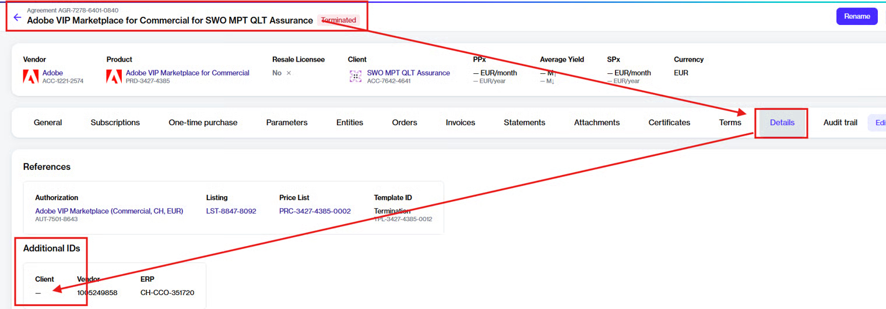
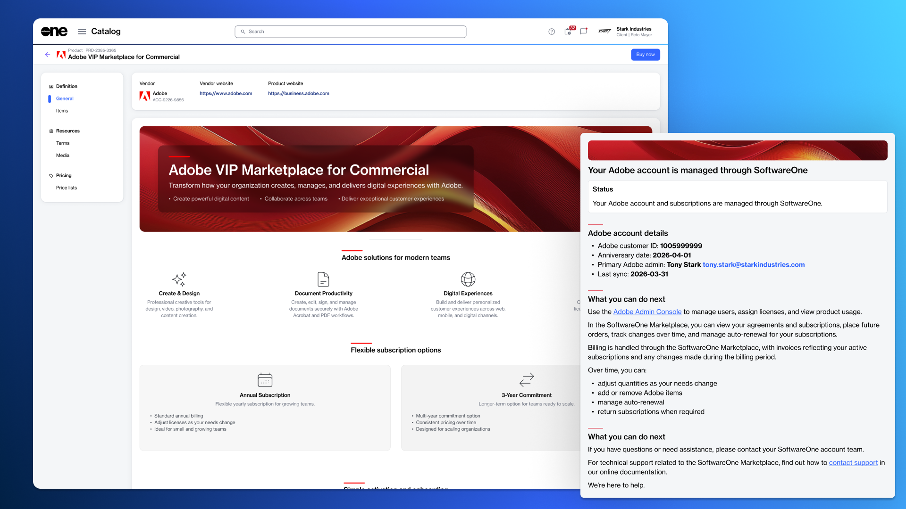
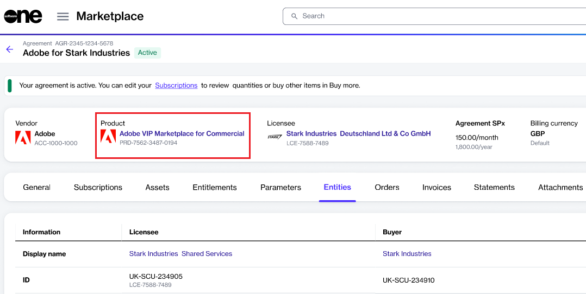
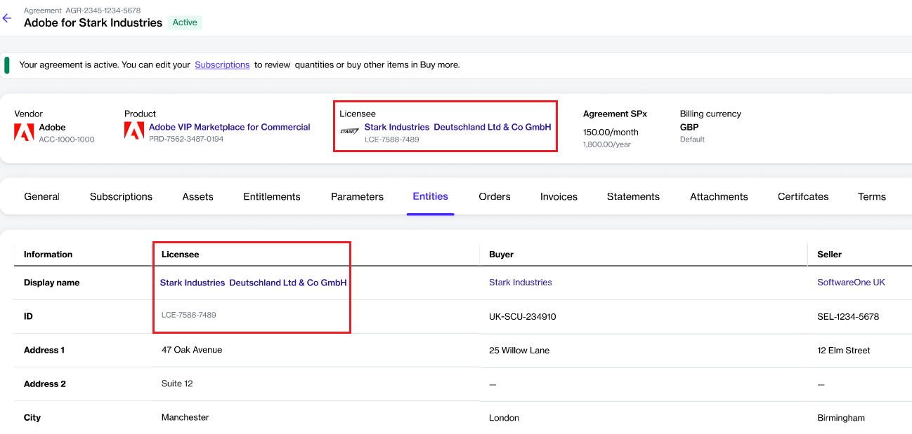
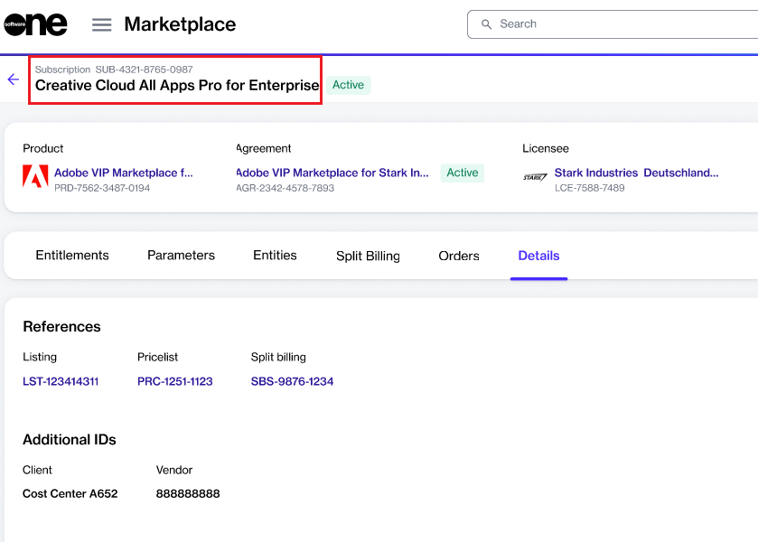
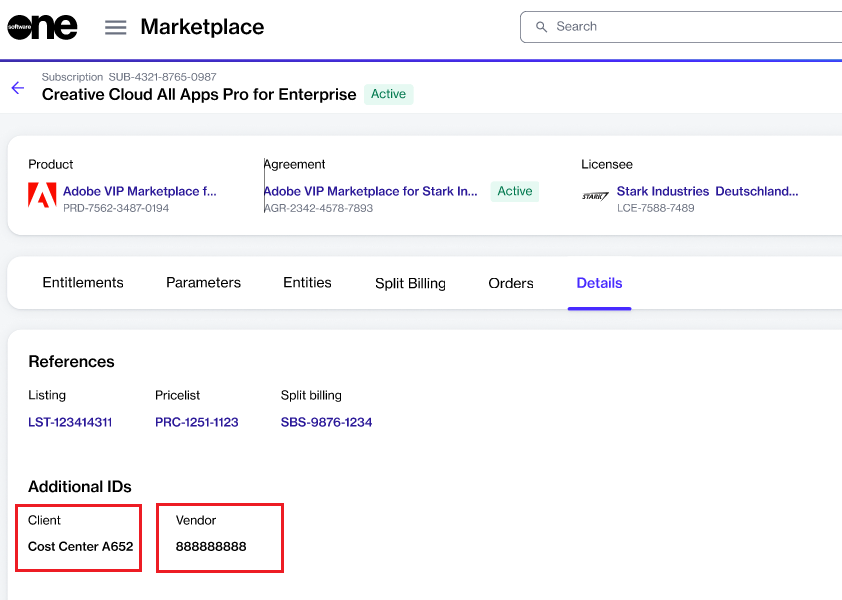

# Invoice Fields Mapping

Your Marketplace invoice includes various details that are pulled from the platform and displayed on the invoice.&#x20;

This topic provides information on all such fields, helping you understand where the information comes from and how it corresponds to your invoice PDF. If you want to learn about the structure of your Marketplace invoices and statements, see the [Billing invoices](./#billing-invoices) and [Billing statements](./#billing-statements) sections, respectively.&#x20;


To see a larger version of the images on this page, select the image. To download a sample PDF, see [this page](./#billing-invoices).


<table data-full-width="false"><thead><tr><th width="173">Invoice PDF Field</th><th width="160">Invoice Location</th><th>Platform UI</th></tr></thead><tbody><tr><td>PO No.</td><td><a href="./#invoice-header">Invoice header</a></td><td>
Mapped from the Additional Client ID in your agreement details.

<figure><figcaption></figcaption></figure>
</td></tr><tr><td>External Document No.</td><td><a href="./#invoice-header">Invoice header</a></td><td>
Mapped from the agreement ID.

<figure><figcaption></figcaption></figure>
</td></tr><tr><td>Your Reference</td><td><a href="./#invoice-header">Invoice header</a></td><td>
Mapped from the statement ID.

</td></tr><tr><td>Agreement</td><td><a href="./#invoice-line-item-details">Invoice line item details</a></td><td>
Mapped from the agreement details page. 

<figure><figcaption></figcaption></figure>
</td></tr><tr><td>Product</td><td><a href="./#invoice-line-item-details">Invoice line item details</a></td><td>
Mapped from the agreement details page. 

</td></tr><tr><td>Licensee </td><td><a href="./#invoice-line-item-details">Invoice line item details</a></td><td>
Mapped from the agreement details page. 

 
</td></tr><tr><td>Subscription</td><td><a href="./#invoice-line-item-details">Invoice line item details</a></td><td>
Mapped from the subscription details page. 

</td></tr><tr><td>Client ID/Vendor ID</td><td><a href="./#invoice-line-item-details">Invoice line item details</a></td><td>
Mapped from the <strong>Details</strong> tab on the subscription details page. 

</td></tr></tbody></table>
