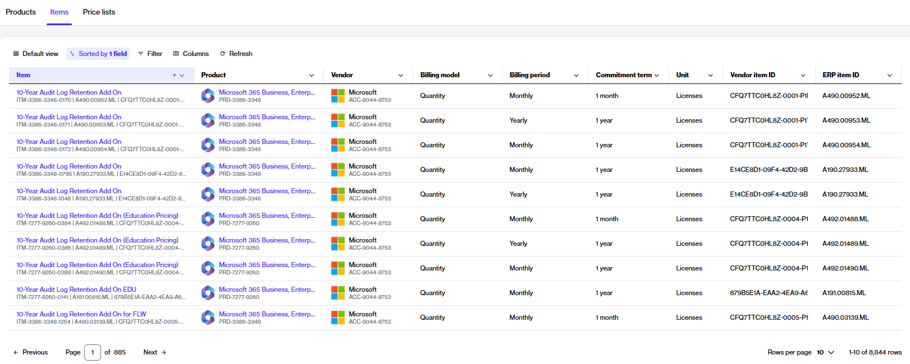

# Items

In the Marketplace Platform, an item is an individual stock-keeping unit (SKU) in a product. Items are part of a product, and they can have their own specific name, term, and commitment.&#x20;

Additionally, there can be one or more items in a product. For example, the _Microsoft 365 Business, Enterprise & Apps - Commercial_ product can include different items, such as Microsoft 365 Business Premium (1-year commitment, annual billing), Microsoft 365 Business Basic (no Teams, 3-year commitment, yearly billing), Microsoft Teams Enterprise (1-month commitment, monthly billing), and more.&#x20;

SoftwareOne clients and partners can view the list of items in the platform and purchase them when placing an order.&#x20;

### Viewing items

To view a list of items:

1. In the main navigation menu, select **Catalog** > **Items**.
2. On the **Items** page, browse the available items. You can customize columns and apply filters according to the item name, product name, vendor, billing model, billing period, and commitment term.

<figure><figcaption>
The Items page in the platform.
</figcaption></figure>

3. To view detailed item information, select the item name. You can then view the full item description and associated price lists.

### Ordering items

Items can only be ordered while creating a purchase order or submitting a change order for an existing agreement. During the item selection step, all available items are displayed, so you can choose and add them to your order as needed.

<figure><figcaption>
Item selection during the ordering process.
</figcaption></figure>

