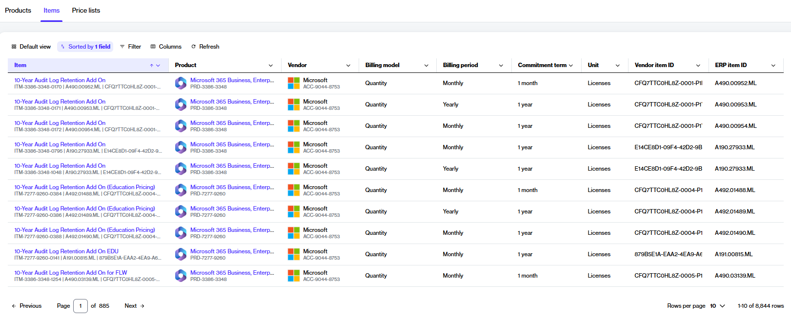

# Items

In the Marketplace Platform, an item refers to an individual stock-keeping unit (SKU) within a product. Items are part of a product, and they have their own specific name, billing model, commitment term, and billing period.&#x20;

A product can contain one or more items. For example, the _Microsoft 365 Business, Enterprise & Apps - Commercial_ product can include different items, such as _Microsoft 365 Business Premium (1-year commitment, annual billing)_, _Microsoft 365 Business Basic (no Teams, 3-year commitment, yearly billing)_, _Microsoft Teams Enterprise (1-month commitment, monthly billing)_, and more.&#x20;

### Accessing items

The **Items** page allows you to view all items that are available for ordering through the SoftwareOne Marketplace.&#x20;

To navigate to the **Items** page, select the main menu, then choose **Catalog** > **Items**. The list of items is displayed. You can find specific items by [applying filters](../../marketplace-platform/getting-started/interface/customize-the-data-grid.md#filtering-data) and [customizing columns](../../marketplace-platform/getting-started/interface/customize-the-data-grid.md#managing-columns).&#x20;


The **Items** page is view-only. You cannot order items from this page. Items can only be ordered when creating a purchase or change order.


<figure><figcaption>
The Items page in the Marketplace Platform.
</figcaption></figure>

### Viewing item details

On the **item details** page, you can view detailed information for a specific item in the catalog.&#x20;

To view item details:

1. Go to **Catalog** > **Items**.
2. Select the item you want to view. The item details page opens.
3. Use the tabs on the item details page to view details, such as a description of the item, price lists, and other details.
