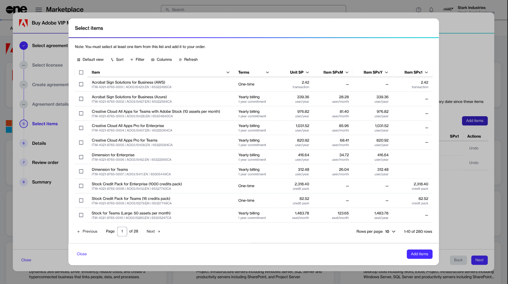

# Items

In the Marketplace Platform, an item refers to an individual stock-keeping unit (SKU) within a product. Items are part of a product, and they have their own specific name, billing model, commitment term, and billing period.&#x20;

Additionally, a product can contain one or more items. For example, the _Microsoft 365 Business, Enterprise & Apps - Commercial_ product can include different items, such as Microsoft 365 Business Premium (1-year commitment, annual billing), Microsoft 365 Business Basic (no Teams, 3-year commitment, yearly billing), Microsoft Teams Enterprise (1-month commitment, monthly billing), and more.&#x20;

You can view the available items on the **Items** page. Items cannot be ordered on their own; they must be added to an order during a purchase order or a change order workflow. During the ordering process, all available items are displayed so you can choose which ones to add to your order.

### Viewing items

To view a list of items:

1. Navigate to the **Items** page.
2. On the **Items** page, browse the available items. You can [customize columns](../../marketplace-platform/getting-started/interface/customize-the-data-grid.md#managing-columns) and [apply filters](../../marketplace-platform/getting-started/interface/customize-the-data-grid.md#filtering-data) according to the item name, product name, vendor, billing model, billing period, and commitment term.

<figure><figcaption>
The Items page in the Marketplace Platform.
</figcaption></figure>

3. To view detailed item information, select the item name. You can then view the full item description and associated price lists.

### Ordering items

Items can only be ordered while creating a purchase order or submitting a change order for an existing agreement.&#x20;

During the item selection step, all available items are displayed, so you can choose and add them to your order as needed.

<figure><figcaption>
Item selection during the ordering process.
</figcaption></figure>

