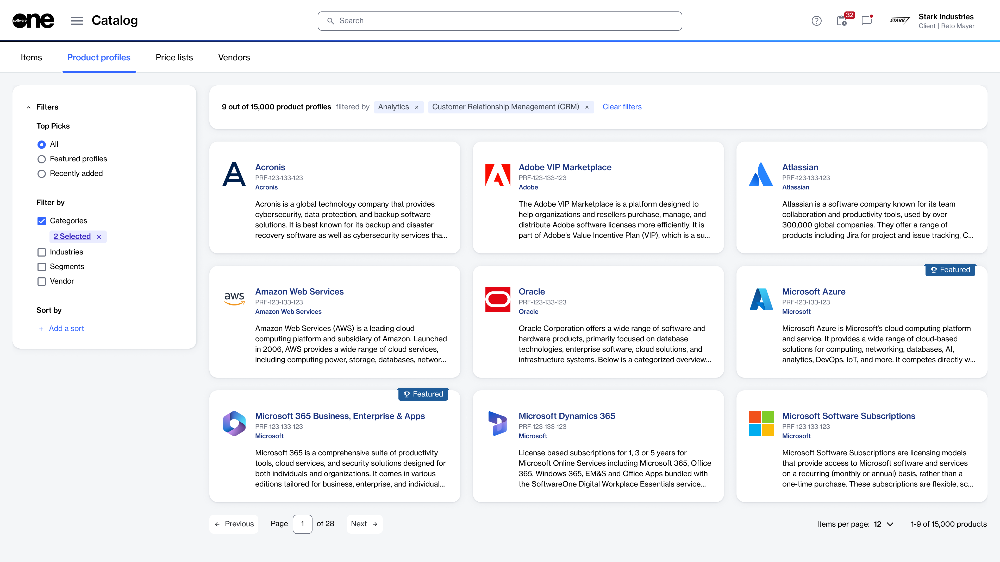

# Product Profiles

The **Product profiles** page within the SoftwareOne Marketplace is a central location to view detailed information for products in our catalog.&#x20;

This page enhances your Marketplace experience by bringing all relevant details together in one place, making it easier to understand a product’s business value and explore additional resources. Each product profile includes a high-level description of the product to help you understand it, along with its features and benefits. You can also view links to the supporting documentation.&#x20;

Product profiles also contain a list of related products. For example, the **Adobe VIP Marketplace** profile includes products, such as _Adobe VIP Marketplace for Government_, &#x41;_&#x64;obe VIP Marketplace for Commercial_, and more. This allows you to choose individual products directly from within the profile and start the ordering process. &#x20;

### Accessing product profiles

To navigate to the **Product profiles** page, select the main menu, then choose **Catalog** > **Product profiles**.&#x20;

<figure><figcaption>
A list of Product Profiles in the SoftwareOne Marketplace.
</figcaption></figure>

The main **Product profiles** page contains a list of product profile cards with filters on the left.&#x20;

* Each card contains a product logo, vendor name, product name, and a brief product description. Selecting a card opens up a profile details page, where you can view a detailed description, images, and a list of products within the profile.
* On the left, a filter sidebar is displayed, allowing you to refine your search.

### Related topics


[filter-product-profiles.md](filter-product-profiles.md)



[view-product-profiles.md](view-product-profiles.md)



[buy-products-from-product-profiles.md](buy-products-from-product-profiles.md)

