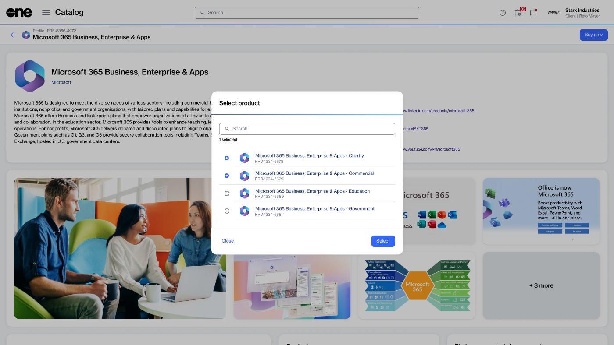

# Buy products from product profiles

After reviewing a product profile, you can start the ordering process directly from within the profile.

### Buying products from product profiles

To order products:&#x20;

1. Go to **Catalog** > **Product profile**.&#x20;
2. (Optional) [Apply filters](filter-product-profiles.md) in the left sidebar to find the profile you want.
3. Select the profile to open its details page, then select **Buy now.**
4. Under **Select product**, choose the product you want to buy.

<figure><figcaption></figcaption></figure>

5. Choose **Select** to start the Purchase Wizard.
6. Complete the guided steps in the wizard to finalize and submit your purchase order. The steps may vary depending on the product and its vendor.
