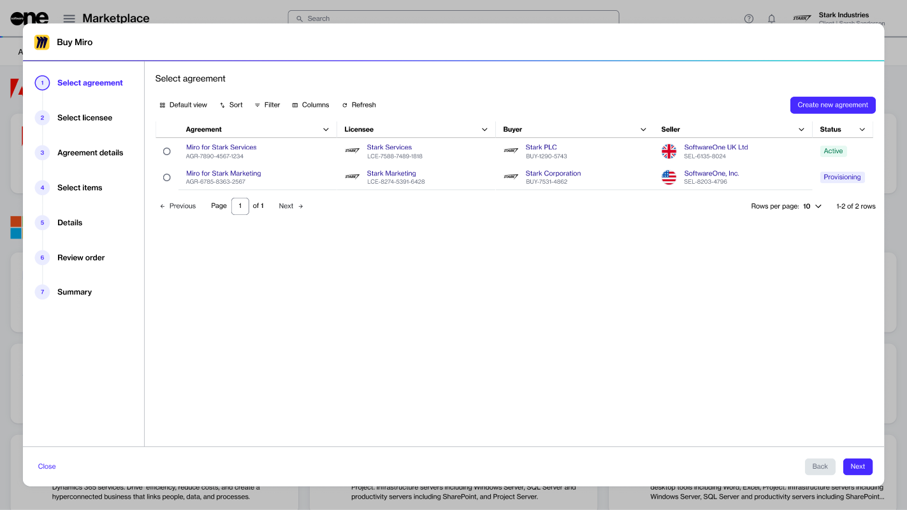

# Products

In the Marketplace Platform, a product refers to a software solution or services offered by a vendor. Each product may contain one or more items (SKUs) available for purchase.&#x20;

Products also contain parameters that are used to gather essential information during the ordering process. These parameters may include details about the agreement, contact person details, item quantity, and more.

### Viewing products

To view products in the Marketplace:

1. In the main navigation menu, select **Catalog** > **Products**.
2. On the **Products** page, browse the list of available products. The list is organised by vendor name and vendor ID.

<figure><figcaption>
The Products page in the Marketplace Platform.
</figcaption></figure>

3. Select a product to open its detail page, where you can view the full description, associated assets, items (SKUs), and pricing or licensing details.

### Ordering products

To order a product:

* On the product details page, select the **Buy now** button. The purchase wizard then launches and guides you through the steps to place your order.

<figure><figcaption>
The purchase wizard containing a series of ordering steps.
</figcaption></figure>

#### Purchase wizard steps

These steps may vary depending on the product. At a high level, you’ll go through the following process:

1. **Select agreement** - Choose an existing agreement or create a new one. The option you select determines the next step. For example, if you choose “Create new agreement”, the **Select licensee** page appears; if you choose an existing agreement, the **Select items** page appears.
2. **Select licensee** - Choose an existing licensee or create a new one.&#x20;
3. **Agreement details** - Complete the contact information form.
4. **Select items** - Choose the items you want to order and set the quantity.
5. **Additional information**  - Add any additional IDs for the order and the agreement.&#x20;
6. **Review order** - Review the order details, read the terms and conditions, and place your order.
7. **Summary** - View your order summary.


Some products may have unique ordering parameters. Follow the steps in the purchase wizard for product-specific steps.&#x20;

