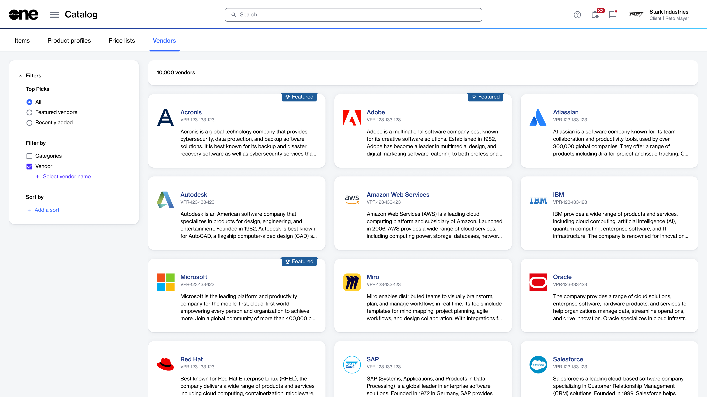

# Vendor Profiles

The **Vendor profiles** page is a centralized location where you can find information about vendors whose products are available in the SoftwareOne Marketplace. Vendor profiles are created and maintained by either SoftwareOne or the vendors themselves, ensuring that you always have access to the most up-to-date information.

From any vendor profile, you can quickly learn about the vendor and explore their products. Each profile includes the vendor's name, a description, a list of products, contact information, and more. You can use the **Vendor profiles** page to:

* Browse and view all available vendor profiles.
* Read the vendor’s description, and view their branding and contact details (if available).
* Discover all products that are linked to the vendor.

Some vendors are marked as **Featured**. These profiles represent strategic partners, promotions, or key vendors in the Marketplace. You cannot mark a vendor as featured or remove the featured status. You also cannot create new vendor profiles or modify the existing ones.

### Accessing vendor profiles

There are two ways to access vendor profiles in the Marketplace.&#x20;

You can either find a specific vendor profile using the **Search** bar in the header or view all vendor profiles on the **Catalog** > **Vendor profiles** page.

<figure><figcaption>
A list of all vendor profiles in the SoftwareOne Marketplace.
</figcaption></figure>

### Related topics


[view-vendor-profiles.md](view-vendor-profiles.md)

