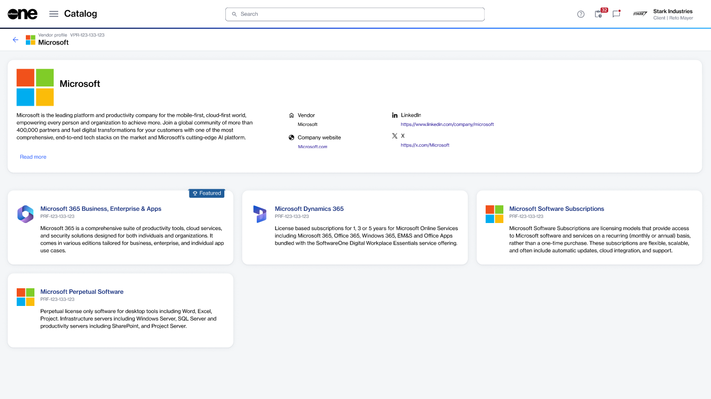

# View vendor profiles

The **Vendor profiles** page displays all vendors whose products are available in the SoftwareOne Marketplace. This topic describes how you can open a vendor profile and see its details.

### Viewing a vendor profile

To view a vendor profile:

1. Go to **Catalog** > **Vendor profiles**.&#x20;
2. (Optional) In the left sidebar, apply filters as necessary to find the desired profile.
3. Select the profile to open its details page.
4. Review the available information, which may include:
   * A full description of the vendor.
   * Branding, including logo and other imagery.
   * The contact details provided by the vendor or SoftwareOne.
   * All published and available products associated with the vendor.

<figure><figcaption>
The details page of a vendor profile.
</figcaption></figure>


* If you see any issue with a vendor profile, such as an outdated description or branding, incorrect or missing contact information, and so on, contact your SoftwareOne account manager or Marketplace Platform Support.
* Only profiles that are published by SoftwareOne or vendors can be viewed in the Marketplace. If you can't find the vendor you are looking for, it may be because they either don't have a profile yet or the profile isn't available for viewing. If you notice a missing vendor profile, contact your SoftwareOne account manager or [Marketplace Platform Support](../../../help-and-support/contact-support.md).

