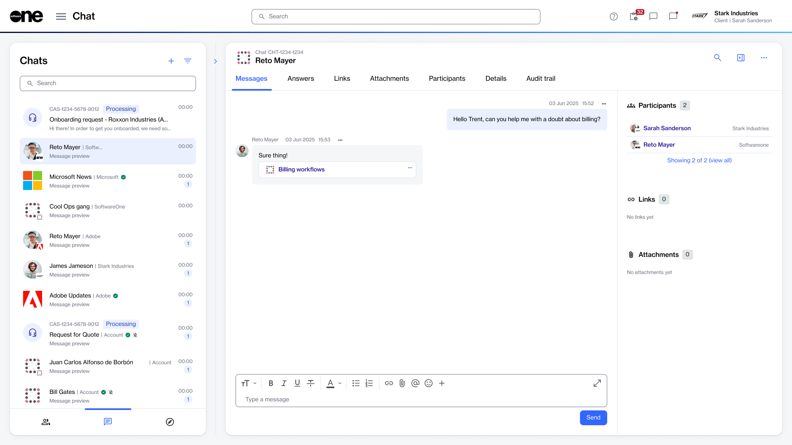

# Chat

A chat is a conversation among different parties within the Marketplace Platform.&#x20;

You can use the **Chat** page to start a conversation with other users in your account and your SoftwareOne account team. All chat conversations are automatically saved, allowing you to pick up where you left off anytime.&#x20;

With the chat feature, you can start direct chats, group chats, and case chats.

* **Direct chat** - Represents a one-to-one conversation with another user.
* **Group chat** - Represents a chat conversation involving multiple users.
* **Case chat** - Represents a chat that is automatically created and linked to a specific [support case](../helpdesk/cases/) in the platform.

When using chat, you can also manage chat participants, leave a group chat, mute or unmute conversations, and edit or delete the messages you have sent.


Chat conversations are limited to active users within the same Marketplace account. External users or users who are not a part of the account cannot be added to a chat conversation.


### Accessing and navigating chat

You can access the **Chat** feature if the **Helpdesk** module is enabled for your account.&#x20;

Once enabled, you can access your chats by selecting **Chat** from the main menu.&#x20;

<figure><figcaption>
The Chat page in the SoftwareOne Marketplace.
</figcaption></figure>

The **Chats** page features an intuitive layout that allows you to start a new conversation and access your existing chats. The page contains:

* **Chat sidebar** - The left sidebar displays all the chat conversations associated with your account. This sidebar is always visible by default and cannot be hidden. From the sidebar, you can [start a direct chat](start-a-direct-chat.md), [start a group chat](start-a-group-chat.md), or create a support case. You can also use the <path d=&#x22;M400-240v-80h160v80H400ZM240-440v-80h480v80H240ZM120-640v-80h720v80H120Z&#x22;/></svg>" data-size="line">**Filter** option to find a chat.&#x20;
* **Chat window or message area** - The chat window shows the content of the chat selected from the left sidebar. If no chat is selected, you see options to select an existing thread or start a new chat. Within an open chat window, you can perform various actions depending on whether it's a direct, group, or case chat.&#x20;
* **Chat details pane** - The details panel on the right shows information, such as participants, links, and attachments. For case chats, you can also view additional details, including the case ID, status, assignee, and more. You can show or hide the details panel using the panel open/close icon <path d=&#x22;M500-640v320l160-160-160-160ZM200-120q-33 0-56.5-23.5T120-200v-560q0-33 23.5-56.5T200-840h560q33 0 56.5 23.5T840-760v560q0 33-23.5 56.5T760-120H200Zm120-80v-560H200v560h120Zm80 0h360v-560H400v560Zm-80 0H200h120Z&#x22;/></svg>" data-size="line">.

### Related topics


[start-a-direct-chat.md](start-a-direct-chat.md)



[start-a-group-chat.md](start-a-group-chat.md)



[manage-group-chats.md](manage-group-chats.md)



[mute-or-unmute-a-chat.md](mute-or-unmute-a-chat.md)



[search-for-chat-messages.md](search-for-chat-messages.md)



[edit-or-delete-messages-in-chat.md](edit-or-delete-messages-in-chat.md)



[update-the-title-for-a-chat.md](update-the-title-for-a-chat.md)

