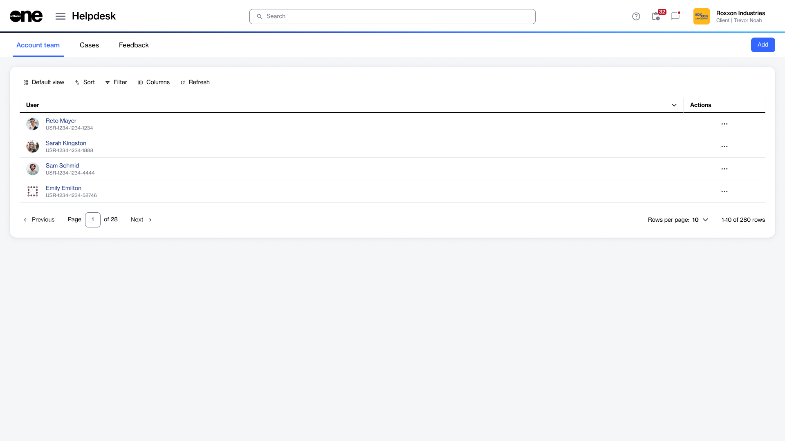

# Account Team

The **Account team** page displays the SoftwareOne account team associated with your Marketplace account. This helps you identify the SoftwareOne contacts responsible for managing and supporting your account.

### Accessing the Account Team page

To navigate to the **Account Team** page, select the main menu, then choose **Helpdesk** > **Account Team**. All SoftwareOne account team members linked to your account are displayed, as shown in the following image:

<figure><figcaption>
Account team page in the Marketplace Platform.
</figcaption></figure>

From this page, you can start a chat conversation with an account team member. You can also send an email or contact them by phone, according to their communication preferences. Additionally, you can use filters to narrow the list.
