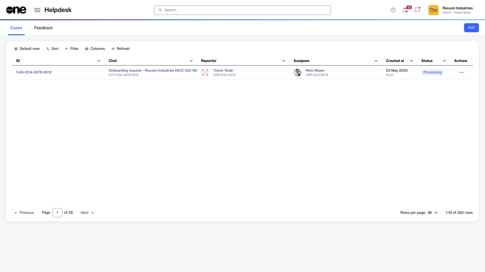

# Cases

A case is a support request or inquiry created when you need more information or help with an issue. Cases allow you to communicate with SoftwareOne and track the progress of your request.

Each case includes important details, such as the case ID, reporter, assignee, status, and the conversation between you and the assignee or individual handling your case. As the issue is reviewed, the case status is updated so you can monitor its progress.

In the SoftwareOne Marketplace, each case includes a conversation thread that allows you to communicate with the assignee.&#x20;

### Accessing cases

You can view and track your submitted cases through the **Cases** page. This page displays all cases created in the scope of your account. It means you can view all cases and their details, including status, regardless of who created them.&#x20;

To navigate to the **Cases** page, select the main menu, then choose **Helpdesk** > **Cases**. The list of cases is displayed, as shown in the following image:

<figure><figcaption>
The Cases page in the platform.
</figcaption></figure>

On the **Cases** page, you can use the [sort and filter options](../../../marketplace-platform/getting-started/interface/customize-the-data-grid.md) and [show or hide specific columns](../../../marketplace-platform/getting-started/interface/customize-the-data-grid.md#managing-columns) to customize the list.&#x20;

You can view case details by selecting the case ID, and you can manage a case by using the options in the **Actions** column.

### Related topics


[case-status.md](case-status.md)



[create-cases.md](create-cases.md)



[view-cases.md](view-cases.md)



[reopen-cases.md](reopen-cases.md)



[complete-cases.md](complete-cases.md)


