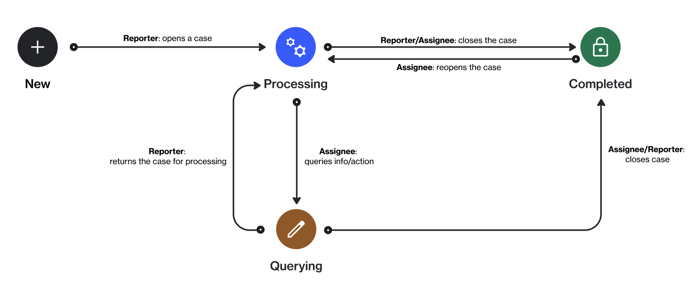

# Case status

A case represents a request, incident, or inquiry exchanged between reporters and assignees in the Marketplace Platform.

A case can currently exist in these states after it has been created: **Processing**, **Querying**, or **Completed**. The following diagram shows the transitions between these states:

<figure><figcaption>
The state transition diagram of a case.
</figcaption></figure>

The following table provides a description of the different states:

<table><thead><tr><th width="203">State</th><th>Definition</th></tr></thead><tbody><tr><td><strong>Processing</strong></td><td>The case has been submitted. It has been assigned and is being worked on by the assignee. </td></tr><tr><td><strong>Querying</strong></td><td>The assignee has requested additional information or clarification from the reporter to proceed further.</td></tr><tr><td><strong>Completed</strong></td><td>The case has been resolved and closed by either the reporter or the assignee. A closed case can be <a href="reopen-cases.md">reopened</a> at any time.</td></tr></tbody></table>
