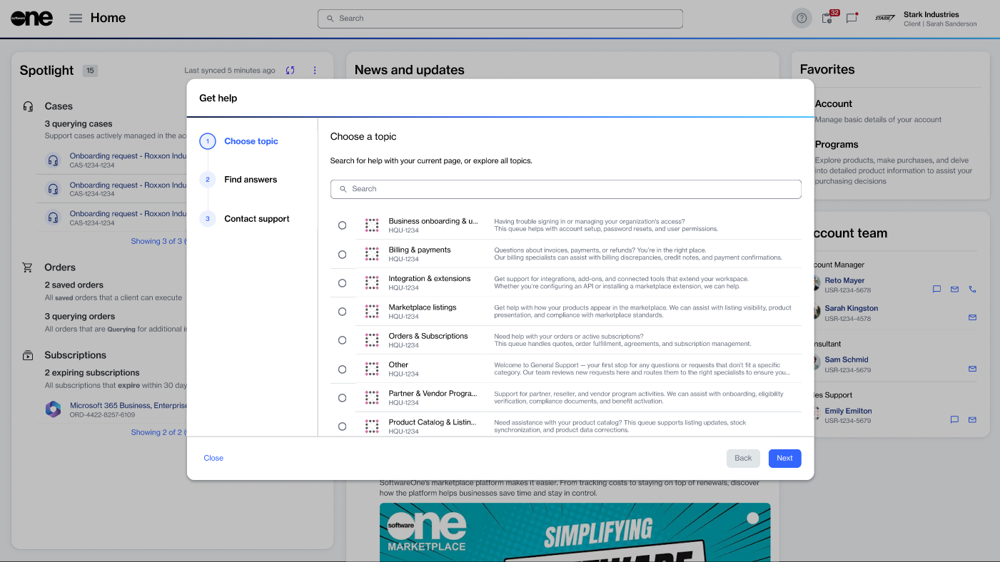

# Create cases

You can create a support case by either selecting the help option in the platform's header or by choosing **+ Support case** on the **Chats** page.&#x20;

### Creating a case using the help icon

To create a case:

1. Select the help icon  in the header. Then, choose **Need help**.
2. In the **Add case** wizard, complete the following steps:
   1. Under **Choose topic**, select the area you need help with, then select **Next**. For example, if you are looking for a quotation, select **Request a Quote**.
   2. Under **Find answers**, explore our self-help resources to see if your question has been answered. If you still need assistance, select **Next** to continue.
   3. Under **Contact support,** describe your issue in detail.
   4. Select **Add** to submit your case.

<figure><figcaption>
Use the help wizard to request assistance.
</figcaption></figure>

### Creating a case from the Chats page

To create a case from the Chats page:

1. Go to the **Chats** page.
2. In the left sidebar, select **+ Support case**.
3. In the **Add case** wizard, complete the following steps:
   1. Under **Choose topic**, select the area you need help with, then select **Next**. For example, if you are looking for a quotation, select **Request a Quote**.
   2. Under **Find answers**, explore our self-help resources to see if your question has been answered. If you still need assistance, select **Next** to continue.
   3. Under **Contact support,** describe your issue in detail.
   4. Select **Add** to submit your case.
