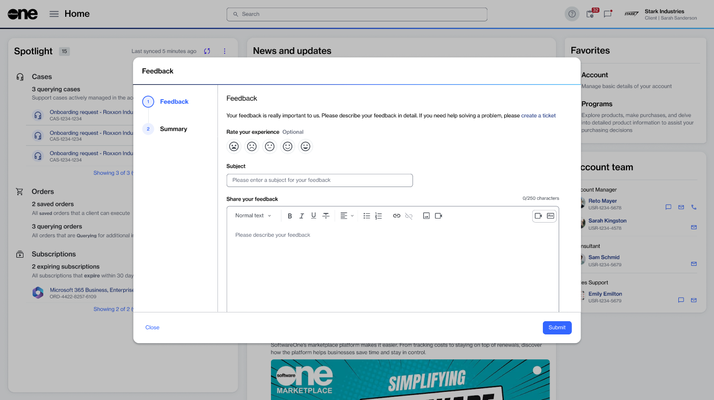

# Feedback

The **Feedback** page enables you to share your comments, suggestions, and experiences about the SoftwareOne Marketplace directly with us. You can also submit ideas on improving existing features and workflows.&#x20;

When submitting feedback, you can provide a rating, enter comments, and include any relevant attachments. Your feedback helps us improve the platform, and we welcome both positive and negative experiences you had while using the platform.&#x20;

### Submitting feedback

You can share your feedback either by selecting the help option in the header or the **Feedback** page.&#x20;

* To share feedback using the help icon, select , then choose **Share Feedback**.
* To share feedback from the **Feedback** page, go to **Helpdesk** > **Feedback**, then select **Share Feedback**.

The **Feedback** wizard allows you to write your comments, attach files, and rate your experience. For key considerations and details on what to include in your feedback, see [Share feedback](../../../help-and-support/share-feedback.md).

<figure><figcaption>
Rate your experience and describe your feedback.
</figcaption></figure>

### Related topics


[feedback-status.md](feedback-status.md)



[view-feedback.md](view-feedback.md)



[edit-or-delete-feedback.md](edit-or-delete-feedback.md)

