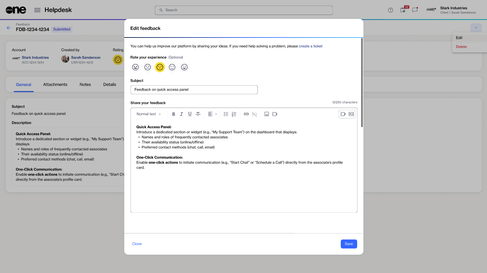
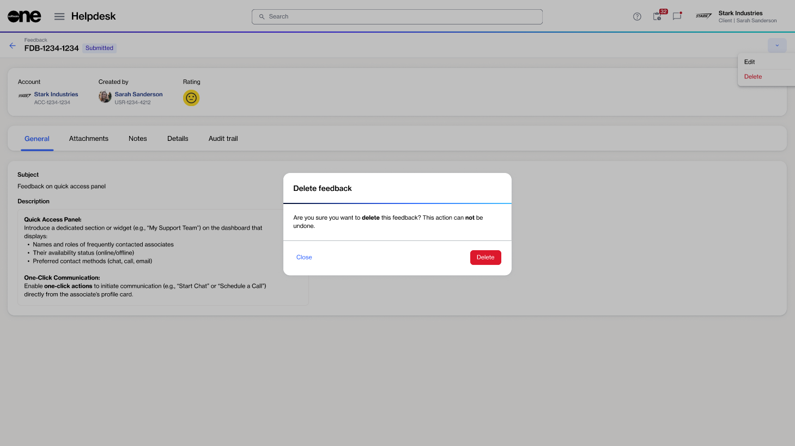

# Edit or delete feedback

If you picked the wrong rating by mistake or want to update your comments or suggestions, you can edit the feedback you've created.&#x20;

You also delete the feedback if you changed your mind or no longer want to share your experience.

Feedback can only be edited or deleted if it has not yet been reviewed by SoftwareOne. If the feedback is already in a **Reviewed** state, it cannot be modified.

### Editing your feedback

To update your feedback item:

1. Go to **Helpdesk** > **Feedback**.
2. (Optional) Use the <path d=&#x22;M400-240v-80h160v80H400ZM240-440v-80h480v80H240ZM120-640v-80h720v80H120Z&#x22;/></svg>" data-size="line">**Filter** option to locate the desired feedback.
3. Select the ID of the feedback you want to update.
4. On the feedback details page, select the down arrow , then choose **Edit**.
5. Change your feedback rating and description as necessary.
6. Select **Save**.

<figure><figcaption>
Edit your submitted feedback.
</figcaption></figure>

### Deleting your feedback


Deleted feedback cannot be recovered.


To delete your feedback permanently:

1. Go to **Helpdesk** > **Feedback**.
2. (Optional) Use the <path d=&#x22;M400-240v-80h160v80H400ZM240-440v-80h480v80H240ZM120-640v-80h720v80H120Z&#x22;/></svg>" data-size="line">**Filter** option to locate the desired feedback.
3. Select the ID of the feedback you want to delete.
4. On the feedback details page, select the down arrow , then choose **Delete**.
5. In the **Delete feedback** dialog, select **Delete** to confirm.

<figure><figcaption>
Delete your feedback permanently.
</figcaption></figure>

