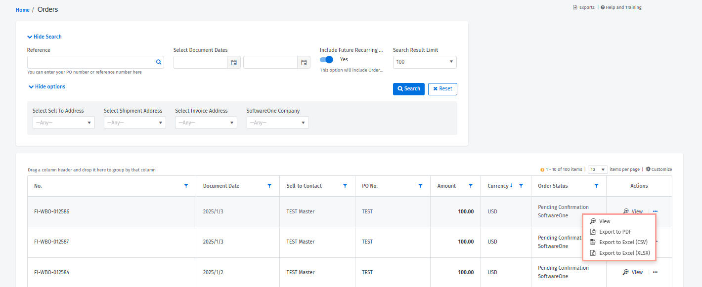

# Orders

With the **Orders** module, you can manage and track your perpetual license orders. The **Orders** page can be accessed from the main menu by selecting **Inventory** > **Orders**. When you open the module, you’ll see all the orders you've placed along with their status.&#x20;

<figure><figcaption>
Orders page
</figcaption></figure>

## Using search

If you are looking to find a specific order, you can use the search options to find the order easily. Different search options are available, for instance, you can search for an order based on its purchase order or reference number, address, and more.&#x20;

When searching, you can also increase the **Search Result Limit** by choosing the required number of results to be returned. If you need to reset the search criteria, you can do so by clicking **Reset**.&#x20;


Video tutorial: How to use search


## Adding and removing columns 

You can also add new columns and remove the ones that are non-essential by clicking the **Customize** option in the grid. Selecting this option opens a new menu, allowing you to choose the columns as necessary. You can resize the columns by clicking in between them.

<figure><figcaption>
Customize option
</figcaption></figure>

## Filtering and sorting orders 

Use the **filter** icon in the column header to apply filters. To sort the data for a column, simply click the column header, or click and then select **Sort** **Ascending** or **Sort** **Descending.**

<figure><figcaption>
Sort options
</figcaption></figure>

## Individual order actions

For each order, the **Actions** column gives you the option to open the order details page by clicking **View**. The details page displays in-depth information for your selected order, including the item details, pricing and tax information, and more.&#x20;

The **Actions** column also lets you export the order information by clicking the actions icon (**•••**) and selecting **Export to PDF**, **Export to Excel (CSV),** or **Export to Excel (XLSX)**.

<figure><figcaption>
Export options
</figcaption></figure>
