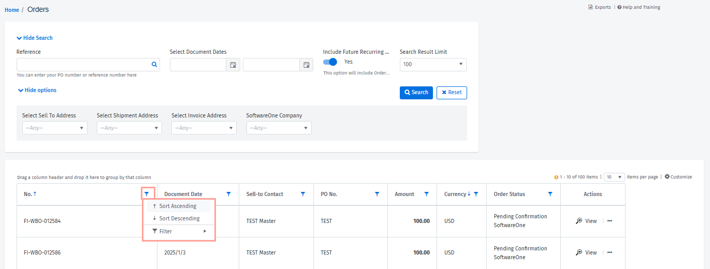
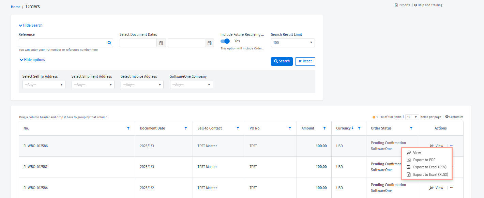

# Sales Orders

The **Sales Orders** page allows you to access your perpetual license orders. You can access this page from the main navigation menu by selecting **Billing** > **Sales Orders**.&#x20;


This topic only relates to perpetual license orders. For subscription-based orders, see the [Orders](../marketplace/orders/) page (available under **Marketplace** in the main navigation menu).&#x20;

To learn about the difference between perpetual license and subscription-based orders, and how to track these orders, see the following video.



Watch our video guide about perpetual license and subscription-based orders in the platform


## Searching for a perpetual license order

If you are looking for an order, you can use the search options to find the order easily.&#x20;

Different search options are available; for instance, you can search for an order based on its purchase order or reference number, address, and more.&#x20;

When searching, you can also increase the **Search Result Limit** by choosing the required number of results to be returned. If you want to reset the search criteria, you can do this by selecting **Reset**.&#x20;

## Adding or removing columns 

You can add new columns and remove non-essential ones by selecting **Customize**.&#x20;

Selecting **Customize** opens a new menu, allowing you to choose the required columns as necessary. You can also resize the columns by clicking between them.

<figure><figcaption>
Customize option
</figcaption></figure>

## Filtering or sorting orders 

Use the filter icon in the column header to apply filters.&#x20;

To sort the data for a column, select the column header, or select the filter icon and then select **Sort** **Ascending** or **Sort** **Descending**.

<figure><figcaption>
Sort options
</figcaption></figure>

## Individual order actions

For each order, the **Actions** column lets you open the order details page by selecting **View**.&#x20;

The details page displays in-depth information for your selected order, including item details, pricing, tax information, and more.&#x20;

You can also export the order information by selecting the actions icon (**•••**) and choosing one of these options: **Export to PDF**, **Export to Excel (CSV),** or **Export to Excel (XLSX)**.

<figure><figcaption>
Export options for an invoice
</figcaption></figure>

