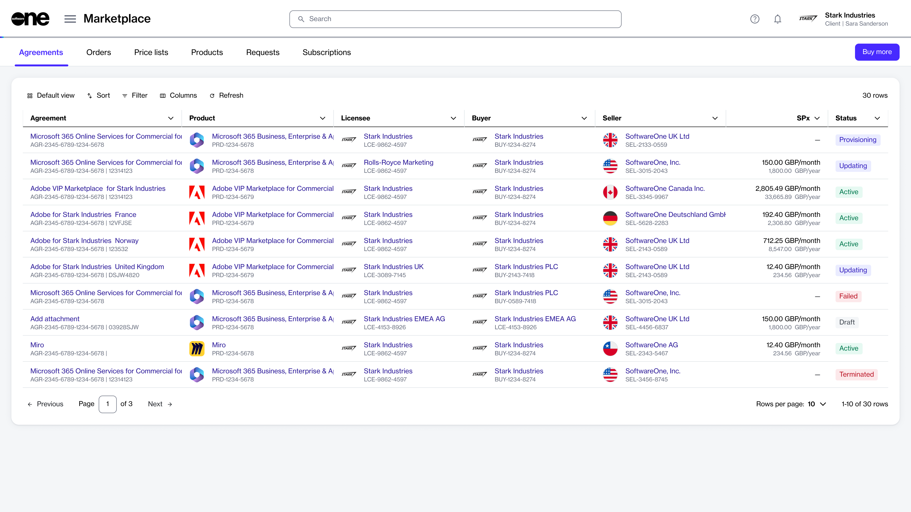
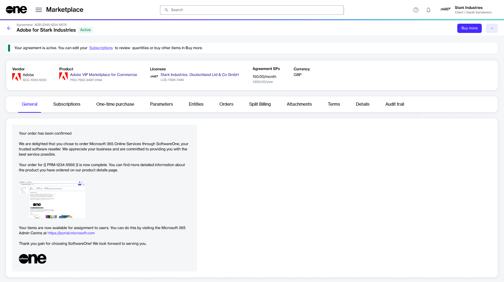

# Agreements

An agreement is a record that establishes the terms and conditions of a transaction in the Marketplace.&#x20;

It defines the relationship between different objects, such as buyers, sellers, and licensees, and serves as the foundation for placing orders and creating subscriptions on the platform.&#x20;

You can access your agreements and manage them through the **Agreements** page. Managing implies renaming an agreement as well as changing an agreement's client ID. If you wish to terminate an agreement, you can do this by terminating all subscriptions in the agreement.&#x20;

## Agreements interface

You can access the **Agreements** page by selecting **Marketplace** > **Agreements** from the main menu.

<figure><figcaption>
Agreements page
</figcaption></figure>

The **Agreements** page displays all agreements that exist in your account. It also contains a **Buy more** option, which gives you quick access to the [Products ](../products.md)page.&#x20;

For each agreement, you can view the following details:

* **Agreement** - Displays the name and ID of the agreement.
* **Product** - Displays the details of the product you've ordered under the agreement.
* **Licensee** - Displays the name and ID of the licensee to whom the license is issued.
* **Buyer** - Displays the buyer linked to the agreement.&#x20;
* **Seller** - Displays the SoftwareOne entity linked to the agreement.
* **SPx** - Displays the estimated sales price of the product.
* **Created** - Displays the date and time when the agreement was created in the platform.&#x20;
* **Currency** - Displays the currency of the price list.
* **Updated** - Displays the date and time when the agreement was updated.&#x20;
* **Status** - Displays the status of the agreement. For a description of the possible statuses, see [Agreement States](agreement-states.md).

### Agreement details page 

The details page of an agreement provides all information related to the agreement. You can open the details page by clicking the agreement name.&#x20;

What can I do on this page?

From the details page, you can complete the following tasks:&#x20;

* [Add more items to your agreement](../../../marketplace-platform/getting-started/marketplace-for-clients/add-items-to-an-agreement.md)
* [Rename an agreement](rename-an-agreement.md)
* [Terminate an agreement](terminate-agreements.md)
* [Activate and manage split billing for certain products](../billing/)
* [View and download attachments](view-and-download-attachments.md)
* [Edit the agreement's ID through the Details tab](edit-agreement-id.md)

<figure><figcaption>
Agreement details page
</figcaption></figure>

The agreement details page shows the agreement's name, ID, and status. Active agreements also contain a **Buy more** option, which starts the purchase wizard and lets you add more items to the agreement. For instructions, see [How to Add Items to your Agreement](../../../marketplace-platform/getting-started/marketplace-for-clients/add-items-to-an-agreement.md). &#x20;

The details page is divided into the following tabs:

* **General** - Displays the general information for the agreement.&#x20;
* **Subscriptions** - Displays the subscriptions within the agreement. You can view the details of each subscription, like the name and ID, commitment term, start date, renewal date, and termination date. The estimated sales price per month and year, along with the subscription status is also displayed.
* **One-time purchase** - Shows the items you've ordered as one-time purchases and the item details. One-time purchase items are non-subscription items where you own the license indefinitely.
* **Parameters** - Displays the different ordering and fulfillment parameters.
* **Entities** - Displays details of the entities linked to the agreement. Entities include licensees, buyers, and sellers.&#x20;
* **Orders** - Displays all orders placed under the agreement, including purchase orders, change orders, and termination orders. Clicking an order opens up the details page of that order.&#x20;
* **Split billing** - Displays the buyers for split billing. This tab is displayed only if split billing has been enabled for the agreement. You can configure buyers by adding buyers or removing existing ones. For details, see [Configure Buyers for Split Billing](../billing/split-billing/configure-buyers-for-split-billing.md).
* **Attachments** - Displays all files attached to the agreement. Attachments are added by the vendor or SoftwareOne, and they can include PDFs as well as your license keys. See [View and Download Attachments](view-and-download-attachments.md) to learn more.
* **Terms** - Displays the terms associated with the agreement and shows when they were accepted, and by whom.
* **Details** - Displays the additional IDs for the agreement, including the client and vendor IDs, and the timestamps of all changes made to the agreement. You can update the client ID using **Edit**. For instructions, see [Edit Agreement ID](edit-agreement-id.md).
* **Audit trail** - Displays all events that have taken place within the agreement. For each audit record, you can view the log details and summary. To learn more, see [Audit Trail](../../settings/audit-trail.md).&#x20;
