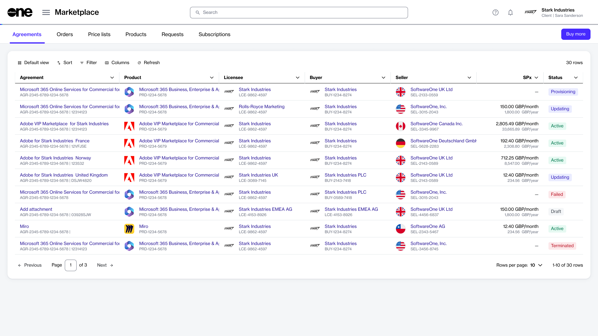

# Agreements

An agreement is a record that establishes the terms and conditions of a transaction in the Marketplace.&#x20;

It defines the relationships among objects, such as buyers, sellers, and licensees, and serves as the foundation for placing orders and creating subscriptions on the platform.&#x20;

### Viewing the list of agreements

To access the list of agreements, go to **Marketplace** > **Agreements**.&#x20;

For each agreement, you can view key details, such as the agreement name, related product, and entities, including licensee, buyer, and seller.&#x20;

You can also view the status of the agreement, estimated sales price, and more.

<figure><figcaption>
The Agreements page in the platform.
</figcaption></figure>

### Viewing agreement details 

On the **agreement details** page, you can view detailed information for the agreement. Some information is read-only, while others include links that allow you to navigate to further details.

To view agreement details:

1. Go to **Marketplace** > **Agreements**.
2. Select the agreement you want to view. The agreement details page opens.
3. Use the tabs on the agreement details page to view different types of information:

<table><thead><tr><th width="174">Tab</th><th>Description</th></tr></thead><tbody><tr><td><strong>General</strong></td><td>Displays the most up-to-date information for the agreement. </td></tr><tr><td><strong>Subscriptions</strong></td><td>Displays all subscriptions that exist within the agreement and the details of those subscriptions.</td></tr><tr><td><strong>Assets</strong></td><td>Shows your one-time purchases. One-time purchase items are non-subscription items where you own the license indefinitely.</td></tr><tr><td><strong>Entitlements</strong></td><td>Displays the items you have purchased along with their details, including quantity, pricing, status, and more.</td></tr><tr><td><strong>Parameters</strong></td><td>Displays the ordering and fulfillment parameters.</td></tr><tr><td><strong>Entities</strong></td><td>Displays the entities linked to the agreement, including licensees, buyers, and sellers. </td></tr><tr><td><strong>Orders</strong></td><td>Displays orders placed under the agreement, including purchase orders, change orders, and termination orders. You can select the order to view the order details page. </td></tr><tr><td><strong>Split billing</strong></td><td>Displayed only if you have enabled split billing. You can view and manage the buyers you have configured for split billing. For details, see <a href="../billing/split-billing/configure-buyers-for-split-billing.md">Configure buyers for split billing</a>.</td></tr><tr><td><strong>Attachments</strong></td><td>Displays all files attached to the agreement by the vendor or SoftwareOne.</td></tr><tr><td><strong>Terms</strong></td><td>Displays the terms associated with the agreement and shows when they were accepted and by whom.</td></tr><tr><td><strong>Details</strong></td><td>Displays reference details, additional IDs, and timestamps.</td></tr><tr><td><strong>Audit trail</strong></td><td>Displays a record of events related to the agreement. For details, see <a href="../../settings/audit-trail.md">Audit Trail</a></td></tr></tbody></table>

### Related topics


[agreement-states.md](agreement-states.md)



[terminate-agreements.md](terminate-agreements.md)



[rename-an-agreement.md](rename-an-agreement.md)



[edit-agreement-id.md](edit-agreement-id.md)



[view-and-download-attachments.md](view-and-download-attachments.md)

