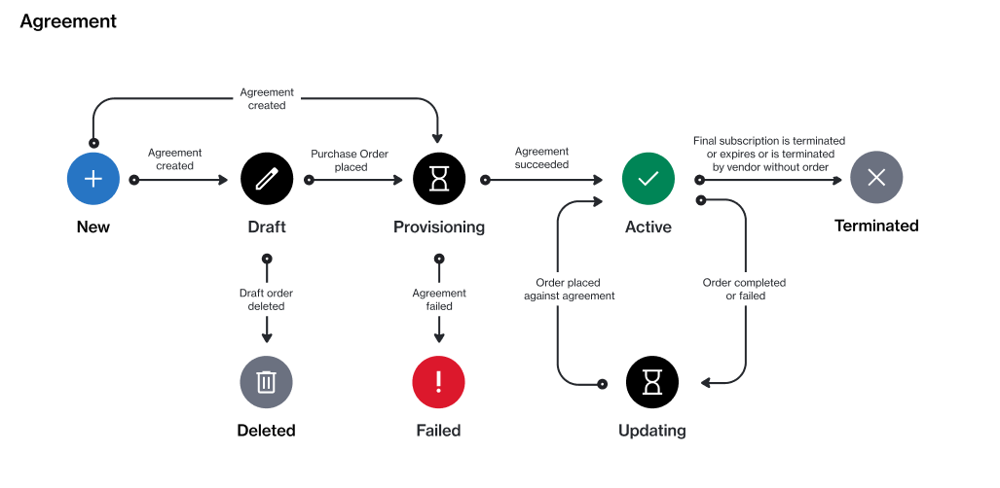

# Agreement status

An agreement is a record that establishes the terms and conditions of a transaction in the Marketplace.&#x20;

An agreement can currently exist in these states: **Draft**, **Deleted**, **Provisioning**, **Failed**, **Active**, **Updating**, or **Terminated**. The following diagram shows the transitions between these states:

<figure><figcaption>
The state transition diagram of an agreement.
</figcaption></figure>

The following table provides a description of the different statuses:

<table data-full-width="false"><thead><tr><th width="152">State</th><th>Definition</th></tr></thead><tbody><tr><td><strong>Draft</strong></td><td>The agreement is saved as a draft because the purchase order is saved for later during the ordering process.</td></tr><tr><td><strong>Deleted</strong></td><td>The draft agreement is deleted because the draft purchase order associated with the agreement is deleted.</td></tr><tr><td><strong>Provisioning</strong></td><td>The agreement is sent to the vendor and is pending fulfilment.</td></tr><tr><td><strong>Failed</strong></td><td>The agreement has failed because the vendor or SoftwareOne canceled the purchase order.</td></tr><tr><td><strong>Active</strong></td><td>The vendor has completed the purchase order, and the agreement is active. Active agreements have at least one active subscription and no open orders.</td></tr><tr><td><strong>Updating</strong></td><td>A business transaction or a change order is in progress for at least one subscription within the agreement.</td></tr><tr><td><strong>Terminated</strong></td><td>The agreement is terminated. It no longer contains an active subscription.</td></tr></tbody></table>
