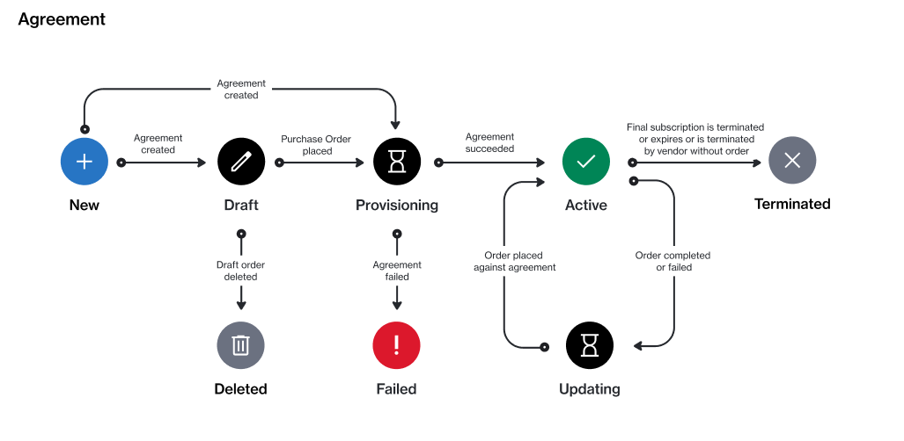

# Agreement States

In the Marketplace Platform, an agreement goes through multiple states (also known as statuses).

The following diagram shows the possible states and the transitions between these states:

<figure><figcaption>
Agreement state transition
</figcaption></figure>

<table data-full-width="false"><thead><tr><th width="152">State</th><th>Definition</th></tr></thead><tbody><tr><td><strong>New</strong> </td><td>This is the default state of a newly created agreement.</td></tr><tr><td><strong>Draft</strong></td><td>The agreement has been saved as a draft because the purchase order has been saved for later during the ordering process.</td></tr><tr><td><strong>Deleted</strong></td><td>The draft agreement has been deleted because the draft purchase order associated with the agreement was deleted.</td></tr><tr><td><strong>Provisioning</strong></td><td>The agreement has been sent to the vendor and it's pending fulfilment.</td></tr><tr><td><strong>Failed</strong></td><td>The agreement has failed because the vendor or SoftwareOne canceled the purchase order.</td></tr><tr><td><strong>Active</strong></td><td>The vendor has completed the purchase order, and the agreement is active. Active agreements have at least one active subscription and no open orders.</td></tr><tr><td><strong>Updating</strong></td><td>A business transaction or a change order is in progress for at least one subscription within the agreement.</td></tr><tr><td><strong>Terminated</strong></td><td>The agreement has been terminated. It no longer contains an active subscription.</td></tr></tbody></table>

## Related topics


[terminate-agreements.md](terminate-agreements.md)



[rename-an-agreement.md](rename-an-agreement.md)



[edit-agreement-id.md](edit-agreement-id.md)



[view-and-download-attachments.md](view-and-download-attachments.md)

