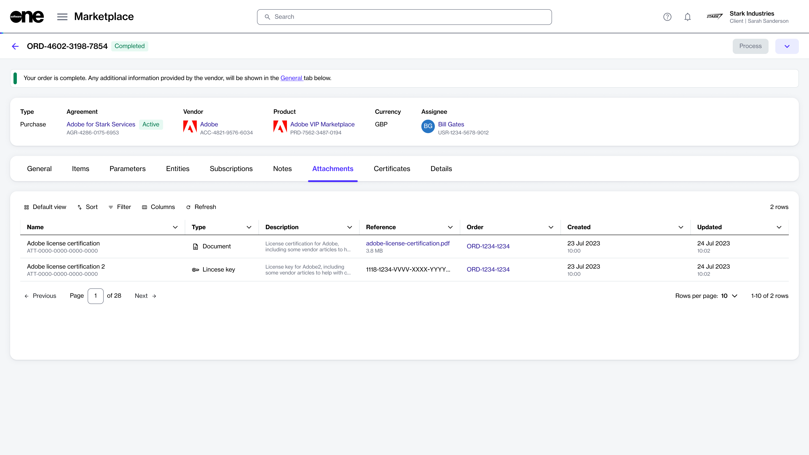

# View and download attachments

The **Attachments** tab on the details page of an agreement displays all files that are added to your agreement by the vendor or SoftwareOne.&#x20;

Attachments can include PDFs and license keys. The file attachments are also available on the **Attachments** tab within the order details page.

### Viewing and downloading attachments

To view and download attachments:&#x20;

1. Go to **Marketplace** > **Agreements**.
2. Select the link for the agreement in the **Agreement** column.&#x20;
3. Select the **Attachments** tab. All files attached to the agreement are displayed.&#x20;

<figure><figcaption>
Use the Attachments tab to view and download files.
</figcaption></figure>

4. Select the filename in the **Reference** column to download it to your system.&#x20;


License keys can only be viewed and copied, not downloaded.

