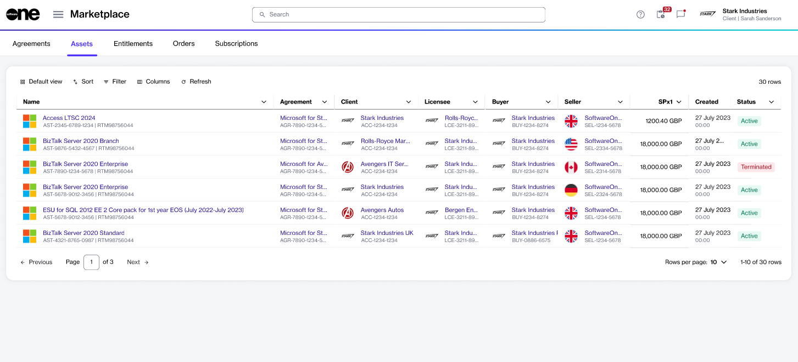
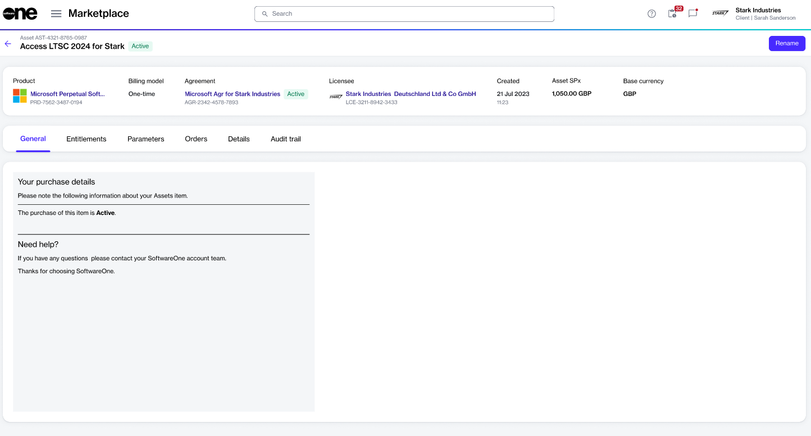

# Assets

The **Assets** page in the platform displays a list of your assets, also called one-time purchase items or perpetual licenses, within the Marketplace Platform.

One-time items are those that are purchased once without any renewal or commitment period. Unlike subscription items that require ongoing payments to keep the license active, a perpetual license remains valid indefinitely and doesn't require recurring payments.&#x20;

### Viewing assets 

To view your one-time purchased items, navigate to the **Assets** page. Your list of assets is also displayed on the **Assets** tab within the [order details](../orders/#order-details) and [agreement details](../agreements/#subscription-details) pages.

When you launch the **Assets** page, all one-time items you have ordered through the Marketplace are displayed. The table provides information, such as the asset name, linked agreement, key entities, estimated sales price, and status.&#x20;

You can use the [sort and filter options](../../../marketplace-platform/getting-started/interface/customize-the-data-grid.md) to customize the list and [show or hide specific columns](../../../marketplace-platform/getting-started/interface/customize-the-data-grid.md#managing-columns) as needed.&#x20;

<figure><figcaption>
The Assets page in the platform.
</figcaption></figure>

### Viewing asset details 

On the asset details page, you can view extended information for your selected asset. Some information on the details page is read-only, while other information includes links that allow you to navigate to further details.

To view the details page for an asset:

1. Navigate to the **Assets** page.
2. (Optional) Use filters to find the desired asset.
3. Select the asset name to view information, such as product name, billing model, the estimated sales price, base currency, and more.


For assets, the billing model is always **one-time** because one-time items don't include any commitment terms or billing periods. For information on the billing models, see this FAQ: [What billing models does Marketplace support for items?](../../../help-and-support/faqs/what-billing-models-does-marketplace-support-for-items.md).


<figure><figcaption>
The details page of an asset.
</figcaption></figure>

4. Use the following tabs to access additional related information:
   * **General** - Displays the most up-to-date information for the asset.&#x20;
   * **Entitlements** - Displays [entitlements](../entitlements/) (meaning, the items you have purchased and the associated quantity) and details, including status, unit price, and estimated sales price (SPx1).
   * **Parameters** - Displays the parameters associated with the asset.&#x20;
   * **Orders** - Displays the purchase order under which the item was purchased.
   * **Details** - Displays reference details, including additional IDs and timestamps. You can edit the additional client ID for the asset using the **Edit** option.
   * **Audit trail** - Displays a record of events related to the asset. For details, see [Audit Trail](https://docs.platform.softwareone.com/modules-and-features/settings/audit-trail).

### Additional actions

From the details page, you can update the asset name. To learn more, see [Rename Asset](rename-asset.md).
