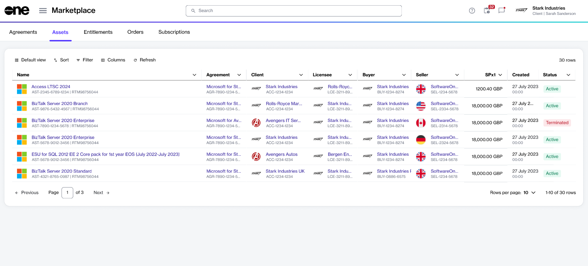

# Assets

The **Assets** page in the platform displays a list of your assets, also called one-time purchase items or perpetual licenses, within the Marketplace Platform.

One-time items are those that are purchased once without any renewal or commitment period. Unlike subscription items that require ongoing payments to keep the license active, a perpetual license remains valid indefinitely and doesn't require recurring payments.&#x20;

### Viewing the list of assets 

To view your one-time purchased items, navigate to the **Marketplace** > **Assets** page. Your list of assets is also displayed on the **Assets** tab within the [order details](../orders/#order-details) and [agreement details](../agreements/#subscription-details) pages.

When you launch the **Assets** page, all one-time items you have ordered through the Marketplace are displayed. The table provides information, such as the asset name, linked agreement, key entities, estimated sales price, and status.&#x20;

You can use the [sort and filter options](../../../marketplace-platform/getting-started/interface/customize-the-data-grid.md) to customize the list and [show or hide specific columns](../../../marketplace-platform/getting-started/interface/customize-the-data-grid.md#managing-columns) as needed.&#x20;

<figure><figcaption>
The Assets page in the platform.
</figcaption></figure>

### Viewing asset details 

On the **asset details** page, you can view detailed information about an asset. Some information on the asset details page is read-only, while other information includes links that allow you to navigate to further details.

To view asset details:

1. Go to **Marketplace** > **Assets**.
2. Select the asset you want to view. The asset details page opens.
3. Use the tabs on the asset details page to view different types of information:

<table><thead><tr><th width="163">Tab</th><th>Description</th></tr></thead><tbody><tr><td><strong>General</strong></td><td>Displays the most up-to-date information for the asset. </td></tr><tr><td><strong>Entitlements</strong></td><td>Displays <a href="../entitlements/">entitlements</a> (meaning, the items you have purchased and the associated quantity) and details, including status, unit price, and estimated sales price (SPx1).</td></tr><tr><td><strong>Parameters</strong></td><td>Displays the parameters associated with the asset. </td></tr><tr><td><strong>Orders</strong></td><td>Displays the purchase order under which the item was purchased.</td></tr><tr><td><strong>Details</strong></td><td>Displays reference details, including additional IDs and timestamps. You can edit the additional client ID for the asset using the <strong>Edit</strong> option.</td></tr><tr><td><strong>Audit trail</strong></td><td>Displays a record of events related to the asset. For details, see <a href="https://docs.platform.softwareone.com/modules-and-features/settings/audit-trail">Audit Trail</a>.</td></tr></tbody></table>


For assets, the billing model is always **one-time** because one-time items don't include any commitment terms or billing periods. For information on the billing models, see [What billing models does Marketplace support for items?](../../../help-and-support/faqs/what-billing-models-does-marketplace-support-for-items.md).


### Related topics


[rename-asset.md](rename-asset.md)

