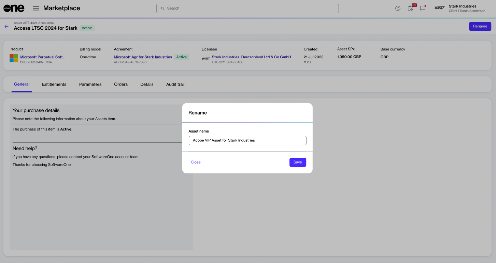

# Rename Asset

You can rename your one-time purchased item from the asset's details page. Only the assets in the **Active** state can be renamed.

When selecting a new name, we recommend choosing a name that makes it easier for you to search for or locate the asset quickly in your list.

Additionally, ensure that the new name is not blank; otherwise, the platform displays a message.

### Renaming an asset 

To update an asset's name:

1. Navigate to the **Assets** page.
2. Find the asset you want to rename.
3. On the asset's details page, select **Rename**.
4. In the **Rename** dialog, enter the new name, then select **Save**.&#x20;

<figure><figcaption>
Rename an asset.
</figcaption></figure>

The asset's name is updated and displayed across all pages featuring the asset within the platform.
