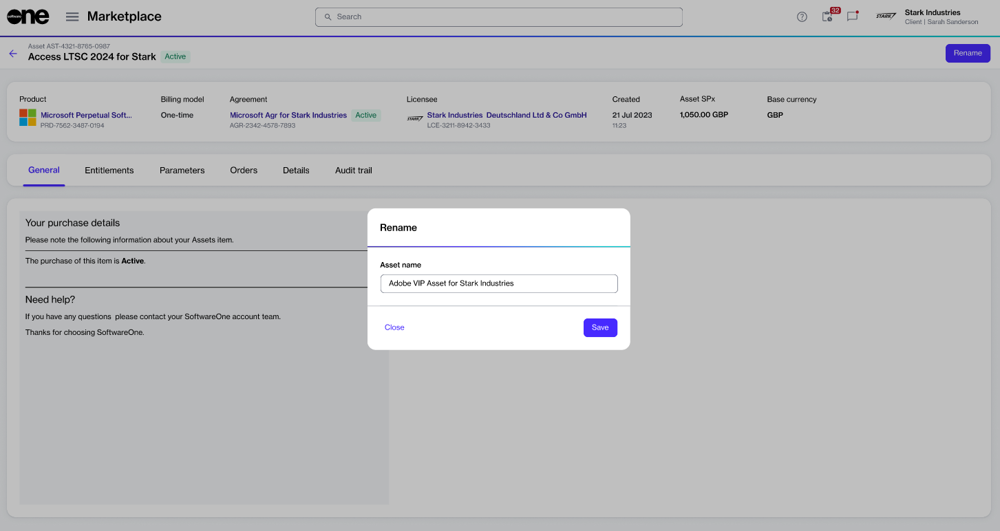

# Rename asset

You can rename your one-time purchased item from the asset details page.&#x20;

Only the assets in the **Active** state can be renamed. When selecting a new name, we recommend choosing a name that makes it easier to search for or locate the asset quickly in your list.

Additionally, ensure that the new name is not blank; otherwise, the platform displays a message.

### Rename an asset 

To rename an asset:

1. Go to **Marketplace** > **Assets**.
2. Select the asset you want to rename.
3. On the asset details page, select **Rename**.
4. In the **Rename** dialog, enter the new name, then select **Save**. The name is updated in the Marketplace.

<figure><figcaption>
Use the <strong>Rename</strong> dialog to update the asset name.
</figcaption></figure>

