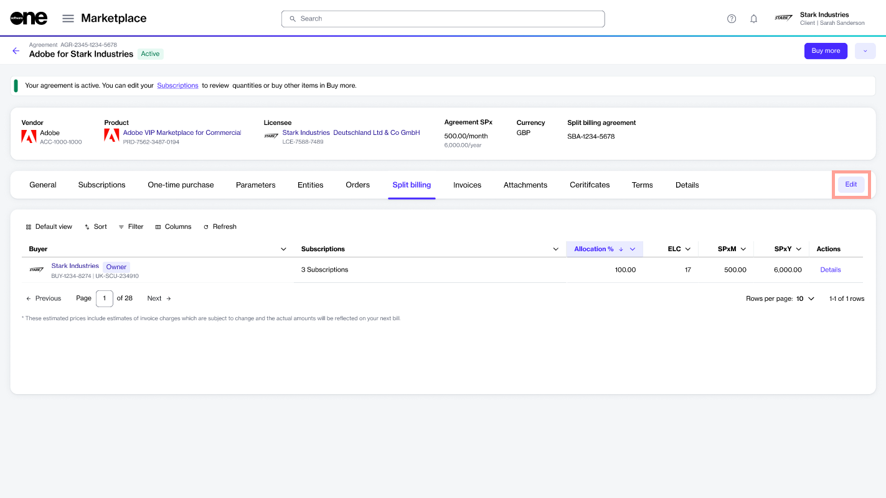

# Configure Buyers for Split Billing

When split billing is activated, the platform assigns 100% of the billing to the default buyer in your agreement, known as the **Owner** buyer.&#x20;

You can configure additional buyers and distribute subscription costs across those buyers using the **Edit** option on the agreement details page.&#x20;

<figure><figcaption>
Edit option on the Split billing tab in the agreement
</figcaption></figure>

## Configuring buyers for split billing

When selecting buyers, there's no limit to the number of buyers you can select, meaning you can choose as many buyers as necessary to divide costs effectively. Follow these steps to configure buyers:

1. Open the details page of your agreement. Make sure that [split billing has been activated](../#activate-split-billing) for the agreement.&#x20;
2. On the **Split billing** tab, click **Edit**.&#x20;

<figure><figcaption>
Edit option on the Split billing tab
</figcaption></figure>

3. In the **Split billing** dialog, select the buyers you wish to add. You can only select buyers that are linked to the seller of this agreement. Additionally, the **Owner** buyer is selected by default and you can't change it.&#x20;

<figure><figcaption>
Add buyers for split billing
</figcaption></figure>

4. Click **Save**. Your newly added buyers will be displayed on the **Split billing** tab in your agreement.


**Need to add more buyers or remove a buyer?**

Use the **Edit** option on the **Split billing** tab to manage buyers as necessary. For instructions, see [Edit split billing](edit-split-billing.md).


## Related topics


[..](../)



[set-up-split-billing-allocation.md](set-up-split-billing-allocation.md)



[edit-split-billing.md](edit-split-billing.md)



[split-billing-for-change-orders.md](split-billing-for-change-orders.md)



[review-split-billing-configuration.md](review-split-billing-configuration.md)



[specify-po-numbers-for-split-billing.md](specify-po-numbers-for-split-billing.md)

