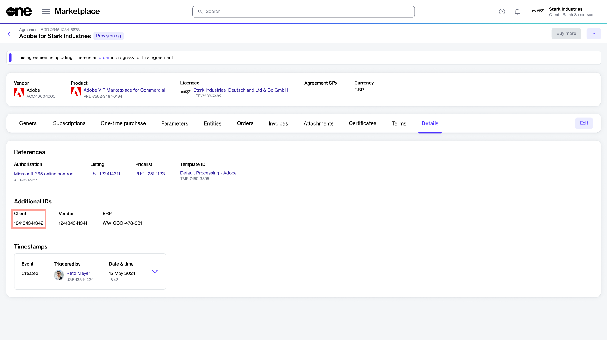
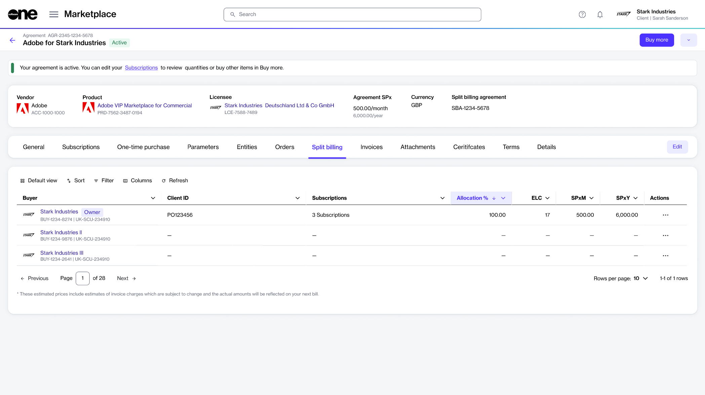
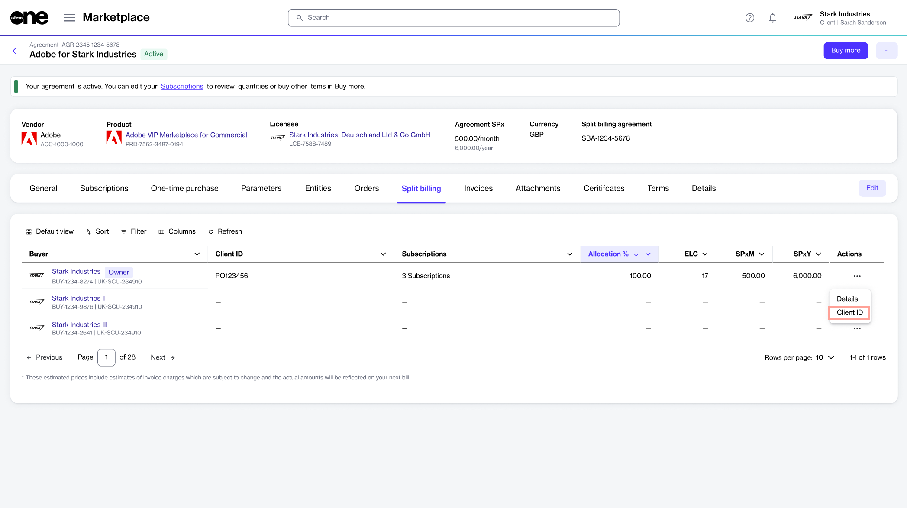
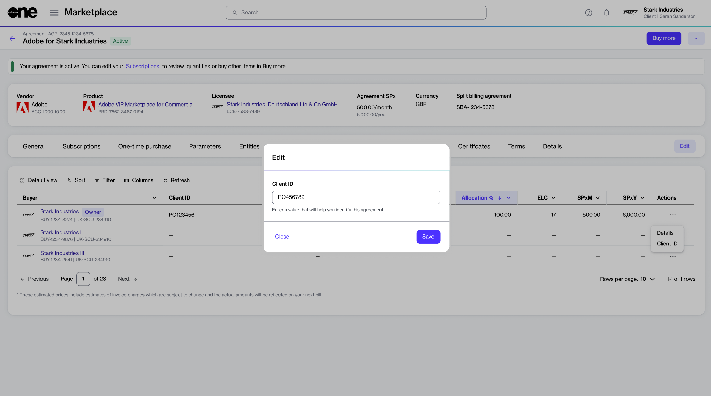

# Specify PO Numbers for Split Billing

In the Marketplace Platform, you can enter additional IDs or purchase order (PO) numbers when ordering a new subscription or adjusting license quantities. Once you've provided the number, it appears on your invoice. For information, see [How can I enter a purchase order number](../../../../help-and-support/faqs/how-do-you-handle-purchase-order-numbers-in-subscription-based-models.md#client-guidance-on-po-numbers-and-invoices).&#x20;

Within the marketplace, the PO number is also displayed as Client ID on the **Details** tab of the agreement:

<figure><figcaption>
PO number/Client ID on the Details tab
</figcaption></figure>

When split billing is activated for the agreement and more buyers are added, the platform assigns the specified client ID to the Owner buyer. By default, no ID is assigned to the additional split billing buyers.&#x20;

If you want to assign IDs to additional buyers in your agreement, follow these steps:

1. Open the required agreement. Make sure that [split billing is activated](../#activate-split-billing) and [buyers are configured](configure-buyers-for-split-billing.md).
2. On the agreement details page, select the **Split billing** tab. The buyers you've configured for the agreement are displayed.

<figure><figcaption>
Split billing tab
</figcaption></figure>

3. Click the actions icon (**•••**) for the desired buyer and select **Client ID**.

<figure><figcaption>
Client ID option under Actions
</figcaption></figure>

4. In the **Edit** dialog, enter the new ID or purchase order number and click **Save**.&#x20;

<figure><figcaption>
Edit client ID dialog
</figcaption></figure>

The value is then updated and displayed as **Client ID** on the **Split billing** tab. This same value is also included on the buyer's invoice in your next billing cycle.

If you are specifying a client ID for more buyers in the agreement, repeat the same steps for each buyer. You can also use the same steps to update the ID, including the client ID for the Owner buyer.

## Related topics


[..](../)



[configure-buyers-for-split-billing.md](configure-buyers-for-split-billing.md)



[set-up-split-billing-allocation.md](set-up-split-billing-allocation.md)



[edit-split-billing.md](edit-split-billing.md)



[split-billing-for-change-orders.md](split-billing-for-change-orders.md)



[review-split-billing-configuration.md](review-split-billing-configuration.md)

