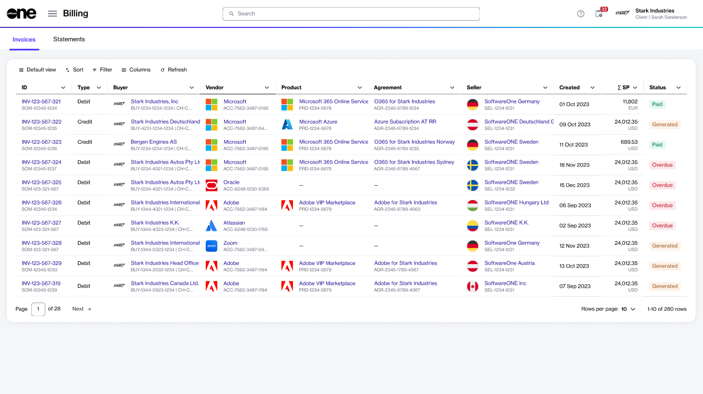
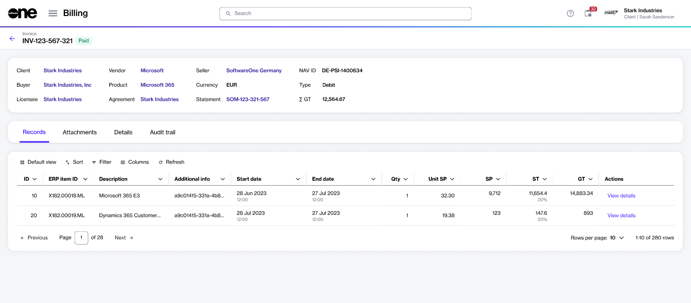

# Invoices

An invoice is a billing document you receive at the end of your billing period.&#x20;

Invoices contain a summary of charges and other details associated with your account. Invoice PDFs also include subscription details and the consolidated charges for all items within the subscription. See [Understand Your Billing Documents](../understand-your-billing-documents.md) to learn more.

In the Marketplace Platform, you can view your invoices on the **Invoices** page. The page is available under **Billing** in the main menu.

<figure><figcaption>
Invoices page in the platform
</figcaption></figure>

The page displays different properties associated with the invoice, such as invoice type, status, and more. Two types of invoices are available, including debit and credit.&#x20;

* A debit invoice includes a summary of charges and the total payable amount.&#x20;
* A credit invoice is generated when there are negative charges due to refunds or returns. Credit memos have a negative total but are still linked to a statement.

## Viewing invoice details 

To view the details page of an invoice, select the invoice ID on the **Invoices** page.&#x20;

<figure><figcaption>
Detials page of an invoice
</figcaption></figure>

At the top of the details page, you can view properties, such as the invoice ID, status. You can also view links to the related business objects and the currency you have been invoiced in. The invoice amount is also displayed.

The invoice details page also contains tabs that provide additional information. The following table lists these tabs:

<table><thead><tr><th width="174">Tab</th><th>Description</th></tr></thead><tbody><tr><td><strong>Records</strong></td><td>Displays various details associated with the invoice, such as the billing cycle, the number of licenses, and charges.</td></tr><tr><td><strong>Attachments</strong> </td><td>Displays the invoice PDF and allows you to download it. </td></tr><tr><td><strong>Details</strong> </td><td>Displays the reference information for the invoice, like the additional IDs and timestamps.</td></tr><tr><td><strong>Audit trail</strong></td><td>Displays an audit trail of the events related to the invoice.To learn more, see <a href="../../../settings/audit-trail.md">Audit Trail</a>.</td></tr></tbody></table>

