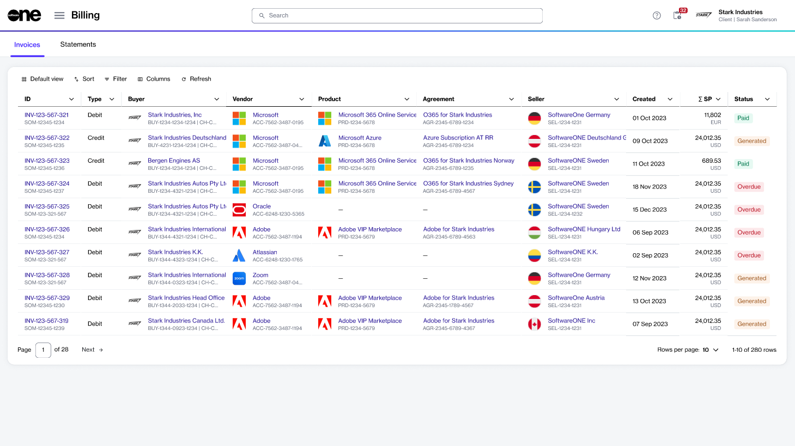

# Invoices

An invoice is a billing document you receive at the end of your billing period.&#x20;

Invoices contain a summary of charges and other details associated with your account. Invoice PDFs also include subscription details and the consolidated charges for all items within the subscription. To learn more about invoices and how they are structured, see [Understand your billing documents](../../../billing/understand-your-billing-documents/).

### Accessing invoices

The **Invoices** page allows you to view all invoices generated for your account.

To navigate to the **Invoices** page, select the main menu, then choose **Billing** > **Invoices**. The list of invoices is displayed as shown in the following image:

<figure><figcaption>
The Invoices page in the platform.
</figcaption></figure>

For each invoice, you can view properties such as invoice ID, total amount due, date of issue, and due date. Additionally, you can view invoice status, including:&#x20;

* **Paid** - Indicates that the invoice has been paid in full. No further action is required.
* **Overdue** - Indicates that the invoice is past due. Invoices in this state require immediate action to prevent service disruptions. Note that overdue invoices may attract penalties, interest, or both, depending on your terms and conditions.
* **Issued** - Indicates that the invoice has been issued, but it hasn't been settled yet.

You can also view invoice details by selecting the invoice name. The information available includes:

* A list of subscriptions and items included in the invoice, along with the total amount.
* Official invoice PDFs.
* A record of events or logs for the invoice.&#x20;

### Related topics


[filter-invoices.md](filter-invoices.md)



[download-invoices.md](download-invoices.md)

