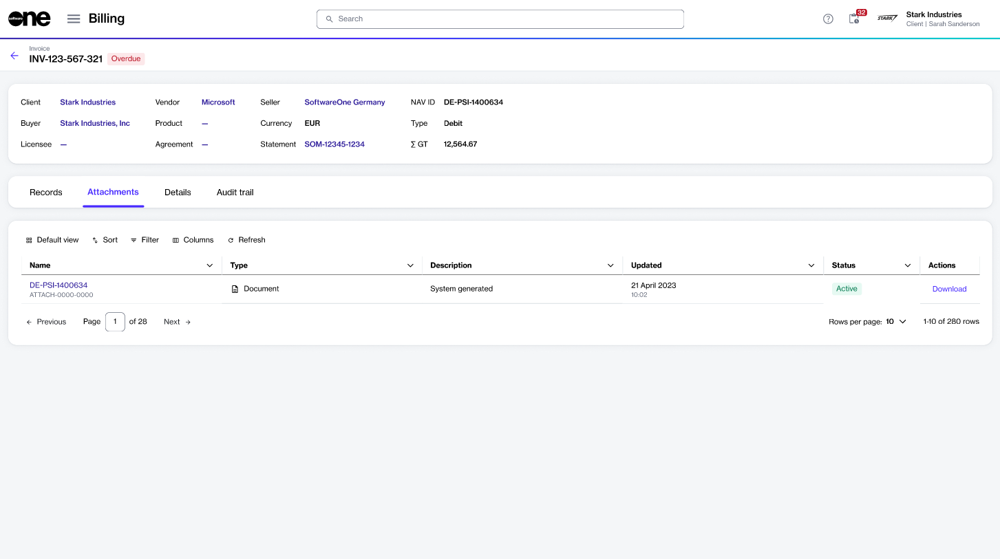

# View and Download Invoices

The Marketplace Platform provides the following options for accessing your invoices:

* You can view all invoices on the **Invoices** page, located under **Billing** in the main navigation menu.&#x20;
* To view detailed information about a specific invoice, select the ID on the **Invoices** page. You can then view the invoice summary on the details page.
* Additionally, you can download an invoice PDF from the invoice details page.&#x20;
* You can also view all invoices for an agreement by selecting the **Invoices** tab on the agreement's details page. &#x20;

## Downloading an invoice

To download an invoice from the invoice details page:

1. Navigate to the **Invoices** page.&#x20;
2. (Optional) Refine your list of invoices. You can apply various filters to find invoices quickly. For details, see [Find Specific Invoices Using Filters](filter-invoices.md).
3. Locate the invoice you want to download. Then, select the link in the **ID** field.
4. On the invoice details page, select the **Attachments** tab.&#x20;
5. Under **Actions**, select **Download**. The selected invoice is downloaded as a PDF.

<figure><figcaption>
Attachments tab on the invoice details page
</figcaption></figure>

For details on how to read and understand your invoice, see [Understand Your Billing Documents](../../../billing/understand-your-billing-documents/).
