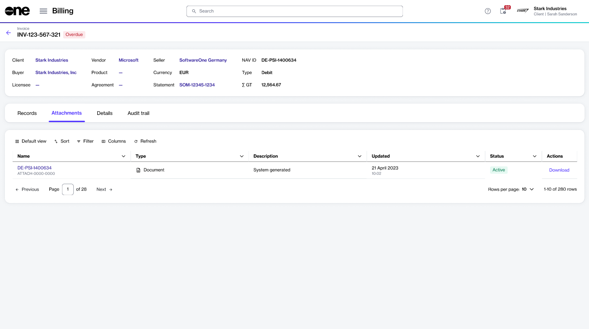

# View and download invoices

The Marketplace Platform provides various options for accessing invoices.&#x20;

You can view all invoices on the **Invoices** page and download them from the details page of the invoice. Additionally, you can view all invoices for an agreement by selecting the **Invoices** tab on the agreement details page. &#x20;

### Viewing invoice details 

The **invoice details** page displays detailed information for the invoice. To view invoice details:

1. Go to **Billing** > **Invoices**.
2. (Optional) Use filters to find the desired invoice.
3. Select the invoice ID. The invoice details page opens.
4. Use the tabs on the invoice details page to view different types of information:

<table><thead><tr><th width="152">Tab</th><th>Description</th></tr></thead><tbody><tr><td><strong>Entities</strong></td><td>Displays the extended information for the entities linked to the invoice.</td></tr><tr><td><strong>Attachments</strong></td><td>Allows you to download the invoice as a PDF. </td></tr><tr><td><strong>Details</strong></td><td>Displays reference information, such as additional IDs and timestamps.</td></tr><tr><td><strong>Audit trail</strong></td><td>Displays an <a href="../../../settings/audit-trail.md">audit trail</a> of the invoice.</td></tr></tbody></table>

### Downloading an invoice

To download an invoice:

1. Go to **Billing** > **Invoices**.&#x20;
2. (Optional) Refine your list of invoices. You can apply various filters to find invoices quickly. For details, see [Find a specific invoice using filters](filter-invoices.md).
3. Locate the invoice you want to download. Then, select the link in the **ID** field.
4. On the invoice details page, select the **Attachments** tab.&#x20;
5. Under **Actions**, select **Download**. The selected invoice is downloaded as a PDF.

<figure><figcaption>
Attachments tab on the invoice details page
</figcaption></figure>

For details on how to read your invoice, see [Understand your billing documents](../../../billing/understand-your-billing-documents/).
