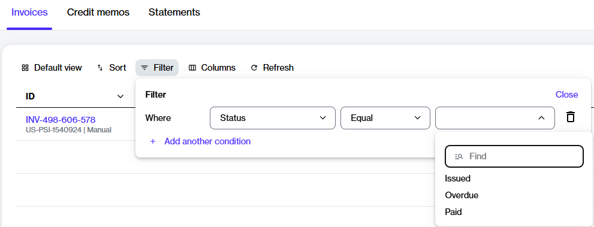

# Find Specific Invoices Using Filters

You can access your invoices by navigating to **Billing** > **Invoices** in the main navigation menu.&#x20;

The **Invoices** page displays all invoices generated for your Marketplace account, allowing you to manage and track them easily. The page also contains filters to help you locate the invoice you want to view. You can find an invoice using criteria, such as invoice status, dates, balance due, and more.&#x20;

This topic describes how to apply the two commonly used invoice filters: **Status** and **Due date**.

## Filtering invoices by status

To view invoices based on their status:

1. On the **Invoices** page, select the **Filter** option in the table.
2. In the **Filters** box, select **Add another condition**, then define the conditions as follows:
   1. Select **Status**.
   2. Set the condition to **Equal**.
   3. Choose one of these conditions as needed: **Overdue**, **Issued**, or **Paid**.

<figure><figcaption>
Finding invoices based on the invoice status.
</figcaption></figure>

3. **Close** the filter box. All invoices matching your specified status are displayed in the table.&#x20;

## Filtering invoices by due date

To view invoices based on their due date:

1. On the **Invoices** page, select the **Filter** option in the grid.
2. In the **Filters** box, select **Add another condition**, then define the conditions as follows:
   1. Select **Due date**.
   2. Set the condition to **Greater, Is null**, or **Lesser** to narrow down the invoices.
      * Use **Greater** to include invoices with a due date after the specified date.
      * Use **Lesser** to include invoices with a due date before the specified date.
   3. Enter the date in the **DD/MM/YYYY** format, or select the calendar icon <path d=&#x22;M200-80q-33 0-56.5-23.5T120-160v-560q0-33 23.5-56.5T200-800h40v-80h80v80h320v-80h80v80h40q33 0 56.5 23.5T840-720v560q0 33-23.5 56.5T760-80H200Zm0-80h560v-400H200v400Zm0-480h560v-80H200v80Zm0 0v-80 80Z&#x22;/></svg>" data-size="line"> to choose a date.

<figure><figcaption>
Finding invoices based on the due date.
</figcaption></figure>

3. **Close** the filter box. All invoices matching your specified criteria are displayed in the table.&#x20;
