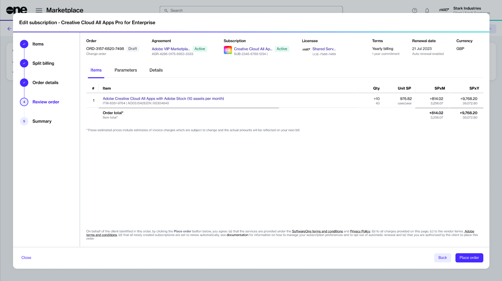

# Split Billing for Change Orders

In the Marketplace Platform, change orders are created when you add more licenses to your subscription and place an order through the platform.&#x20;

If split billing is active for your agreement, you can select buyers and assign billing to those buyers when placing the order.


Note that this method of split billing only works for certain products in our platform.&#x20;


Follow these steps to split billing when ordering additional licenses:

1. Open the details page of the subscription and click **Edit** in the upper right. Make sure that [split billing is activated](./#activate-split-billing) for the agreement and [buyers are configured](configure-buyers-for-split-billing.md).
2. Increase the quantity as needed in the **New Qty** field and click **Next**. In the following image, the quantity is updated from **30** to **40** for one of the items in the subscription.

<figure><figcaption>
Items section
</figcaption></figure>

3. Select the buyer you want to allocate the billing to.&#x20;
   * Choosing **None** allocates the billing based on configured split percentages for this subscription.
   * Choosing a buyer allocates the billing according to the percentage set for this buyer.&#x20;

<figure><figcaption></figcaption></figure>

4. Enter the reference information for this order and click **Next** to continue.

<figure><figcaption></figcaption></figure>

5. Review the information on each tab and click **Place order** to finalize.

<figure><figcaption></figcaption></figure>

6. Click **View Order** to navigate to the order details page. Otherwise, click **Close**.


After you've placed a change order, you might need to review your billing allocations. For instructions, see [Review Split Billing Configuration](review-split-billing-configuration.md).


## Related topics


[.](./)



[configure-buyers-for-split-billing.md](configure-buyers-for-split-billing.md)



[set-up-split-billing-allocation.md](set-up-split-billing-allocation.md)



[edit-split-billing.md](edit-split-billing.md)



[review-split-billing-configuration.md](review-split-billing-configuration.md)



[specify-po-numbers-for-split-billing.md](specify-po-numbers-for-split-billing.md)

