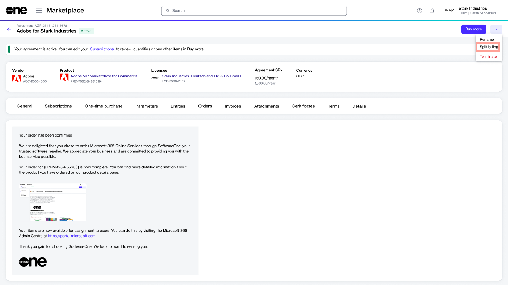

# Split Billing

Split billing is a feature that allows you to divide the billing for your subscriptions among different buyers in your account. 

Designed for organizations with multiple legal entities, split billing lets you select buyers and allocate billing for your subscriptions to different buyers. This enables cost-sharing and accurate tracking of consumption. It also ensures that each buyer is accountable for a share of the subscription cost based on usage.

You can divide the subscription costs easily by specifying percentages or estimated license count (ELC) for each buyer. Once defined, these details are used during invoicing to generate separate invoices for each entity. In cases where split billing is enabled but the split hasn't been defined, 100% of the billing is allocated to the default buyer in your agreement, also known as the **Owner** buyer. 

The platform also lets you allocate billing when ordering additional subscription licenses. It means when creating a change order for an increase in subscription quantity, you can select buyers and allocate billing to those buyers. 

## Split billing rules

In the Marketplace Platform, the following rules apply to split billing:

* Split billing must be activated at the agreement level. Once activated, this feature cannot be deactivated.
* After activating split billing, new purchases under the agreement are invoiced based on the allocation percentage or the specific buyer you've allocated the subscription billing to.
* The ELC is indicative only. The Split billing feature is designed around allocation percentages, which means the platform always considers percentages during billing. 
* You can modify the allocation for your active subscriptions at any time. However, the changes will only take effect in your next billing cycle.
* Buyers can only be removed from split billing if they have no configured allocation percentage. The platform doesn't allow you to remove buyers if an allocation percentage exists for those buyers.

## Activate split billing


Currently, only Adobe VIP Marketplace supports split billing. 


You can activate split billing using the **Split Billing** option on the details page of your agreement. For instructions, see [Activate split billing](../../../../marketplace-platform/getting-started/marketplace-for-clients/how-to-split-billing-across-buyers.md#id-1.-activate-split-billing).

<figure><figcaption>
Split billing option on the agreement details page
</figcaption></figure>

Once activated, the **Split billing** tab appears on the agreement’s details page.&#x20;

By default, the buyer associated with the agreement is set as the **Owner** buyer, and 100% billing is allocated to the owner buyer. You can configure additional buyers using the **Edit** option. For more information, see [Configure Buyers for Split Billing](configure-buyers-for-split-billing.md).

<figure><figcaption>
Close option on the Split billing details tab
</figcaption></figure>
