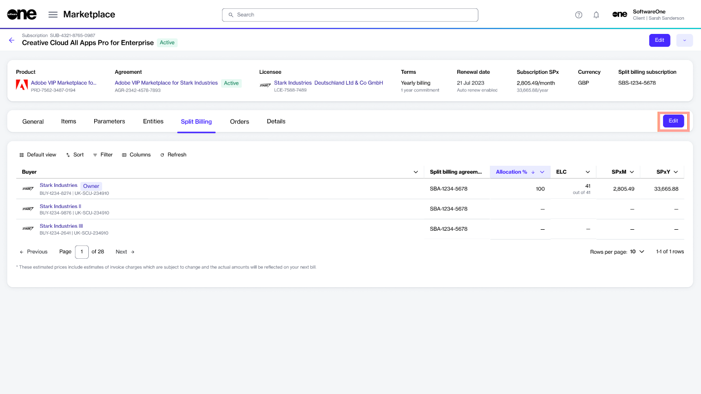
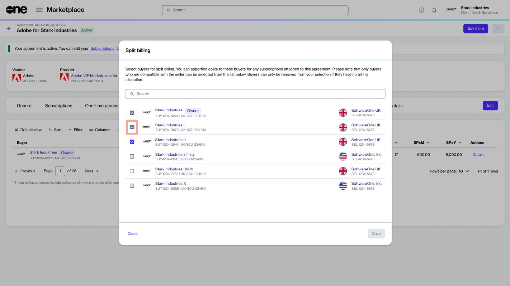
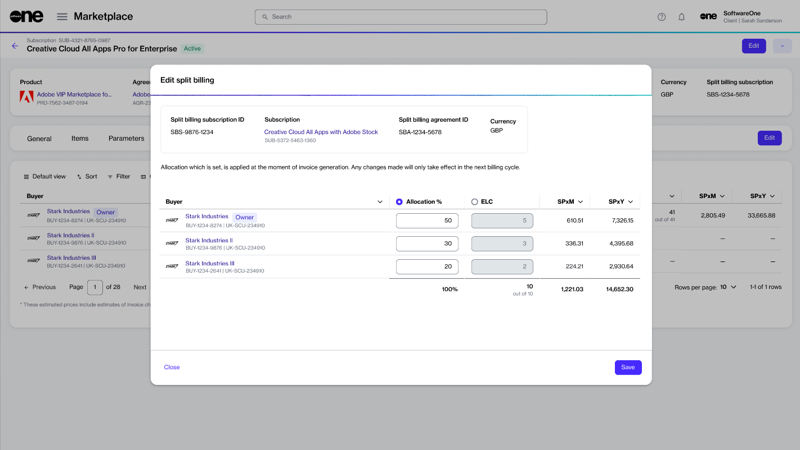

# Edit Split Billing

If you need to update the list of buyers and adjust their allocation percentages after setting up split billing, you can easily do so through the interface.

## Adding or removing buyers

After you've set up split billing, you can add new buyers and remove existing buyers as needed using the **Edit** option on the **Split billing** tab of your agreement.&#x20;

<figure><figcaption>
Edit option on the Split billing tab
</figcaption></figure>

When removing buyers, only those without an allocation percentage can be removed. This means you'll need to assign the allocation percentage to another buyer before removing them from split billing.&#x20;

If an allocation exists for the buyers you wish to remove, the buyer checkbox is unavailable, as shown in the following image:

<figure><figcaption>
List of split billing buyers
</figcaption></figure>

## Updating the allocation percentage or license count


This section describes how to update the allocation percentage using the subscription details page. You can also update the allocation via the agreement details page.


If you need to make any modifications to the allocation percentage for any of the buyers, you can edit the split billing details at any time.

Follow these steps to edit the allocation percentage for a buyer:

1. Open the details page of the required subscription.
2. On the **Split billing** tab, click **Edit**.
3. In the **Edit split billing** dialog, make the necessary changes to the allocation percentage or license count. Make sure that 100% is allocated across buyers.

<figure><figcaption>
Edit split billing dialog
</figcaption></figure>

4. **Save** your changes. The **Split billing** tab displays the updated allocation details. Note that the changes only take effect in your next billing cycle.&#x20;
