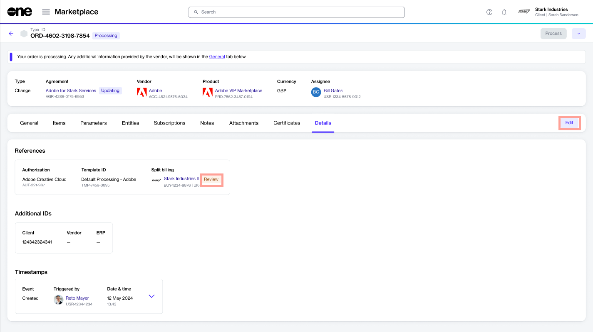

# Review Split Billing Configuration

The **Review** status on the **Details** tab of a change order indicates that a change has been made to the subscription.&#x20;

When you see this status, it means that you need to review the split billing configuration for the subscription, as it may need adjustment.&#x20;

<figure><figcaption>
Review status and Edit option
</figcaption></figure>

You can review the allocation by clicking **Edit**. When the **Edit** dialog opens, review the details. If any changes are needed, you can update the split as necessary and then save your changes.&#x20;
