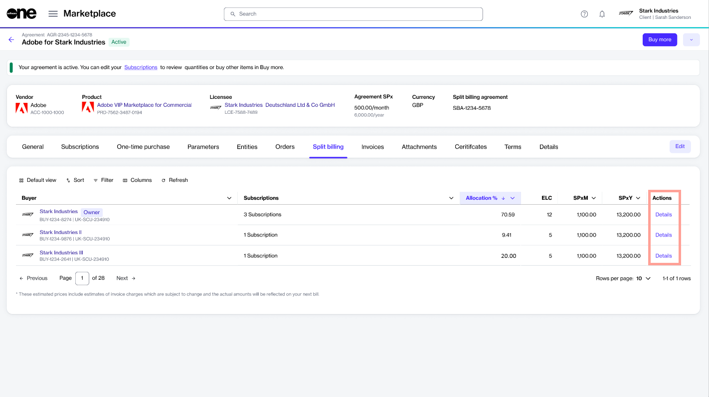
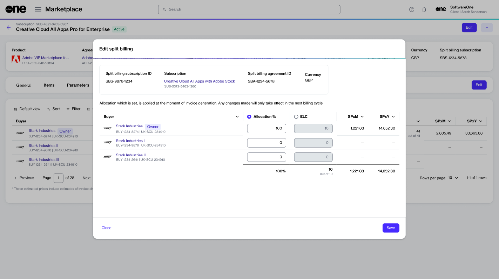
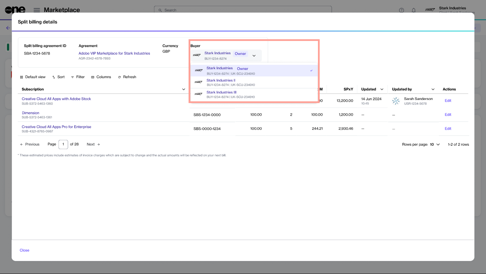

# Set Up Split Billing Allocation

If you have [configured buyers](configure-buyers-for-split-billing.md), but have not defined the split breakdown yet, 100% of the subscription billing is allocated to the **Owner** buyer in your agreement.&#x20;

You can update the split to include additional buyers and allocate billing to those buyers. There are two ways to configure the split.

**Method 1 - Using the Edit option on the subscription details page**

<figure><figcaption>
Edit option on the subscription details page
</figcaption></figure>

**Method 2 - Using the Details option on the Split billing tab within your agreement details**

<figure><figcaption>
Details option on the Split Billing tab of the agreement
</figcaption></figure>

## Method 1 - Subscription details page

The **Split billing** tab on the subscription details page displays the allocation for all buyers and allows you to divide the billing across different buyers in your account.

Follow these steps to set up allocations:&#x20;

1. On the **Split billing** tab, select **Edit**. The **Edit** **split billing** dialog opens.

<figure><figcaption>
Edit split billing dialog
</figcaption></figure>

2. Enter the allocation percentage or estimated license count for the required buyers and click **Save**. Make sure that 100% of the cost is allocated.

<figure><figcaption></figcaption></figure>

The updated split details are displayed on the **Split billing** tab of your subscription.

## Method 2 - Agreement details page &#x20;

The **Split billing** tab within the agreement details page displays the allocation for your assigned buyers. Use the **Details** option for each buyer to adjust the billing percentage or the estimated license count.

Follow these steps to split the billing:

1. On the **Agreements** page, select the required agreement. Make sure that [split billing is activated](../#activate-split-billing) and [buyers are configured](configure-buyers-for-split-billing.md).
2. Select the **Split billing** tab. Your selected buyers are displayed.&#x20;
3. Click the **Details** option for the buyer for which you want to update the allocation.&#x20;

<figure><figcaption>
Split billing tab 
</figcaption></figure>

4. In the **Split billing** **details** dialog, click the **Edit** option for the required subscription.

<figure><figcaption>
Split billing details
</figcaption></figure>

5. In **Edit split details**, choose whether you want to update the allocation % or the estimated license count. The **allocation %** option is selected by default, but you select **ELC** if required.
   1. **Allocation %** - Select this option to split the subscription billing based on the percentage. For example, you can split the total allocation percentage of 100% between two buyers as 30% and 70% respectively.
   2. **ELC** - Select this option to split the billing based on the license count. For example,  if you have 12 subscription licenses you can split these between two buyers as 8 and 4 licenses respectively.
6. Enter a value based on the split percentage or license count and click **Save**. Make sure that 100% of billing or all licenses are allocated. Otherwise, the platform displays a message.

<figure><figcaption>
Edit split billing
</figcaption></figure>

The allocation is updated for your selected buyer. Use the **Buyer** menu in the highlights panel to view the allocation details for the other buyers.

<figure><figcaption>
Buyers menu
</figcaption></figure>

7. Click **Close** to return to the **Split billing** tab.


**Do you want to make modifications to the split allocation?**

Allocation percentages can be modified using the **Edit split billing** dialog. For instructions, see [Edit split billing](edit-split-billing.md).

