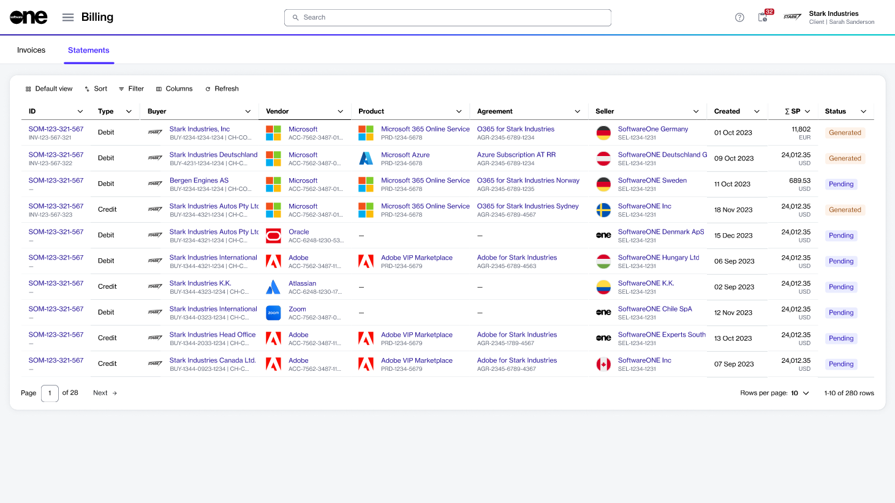
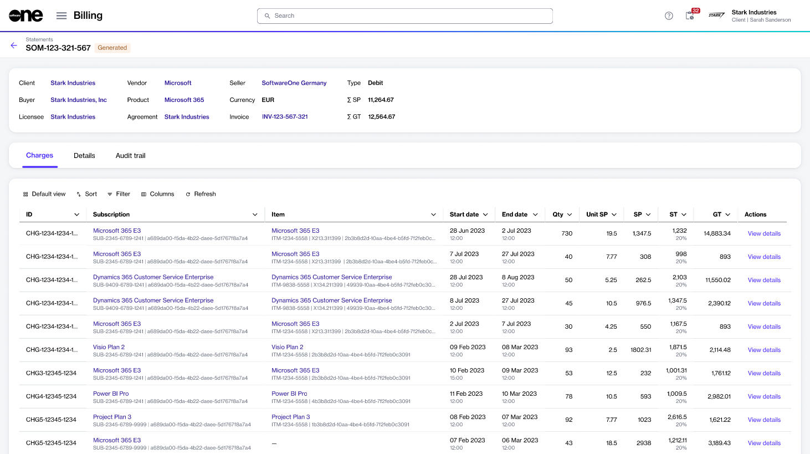

# Statements

A statement is a billing document you receive at the end of your billing period, along with your invoice PDF.

Statements are available in XLSX format and contain a detailed view of your invoice data, including individual charges and subscriptions for the billing period. See [Understand Your Billing Documents](understand-your-billing-documents.md) to learn more.&#x20;

In the Marketplace Platform, your statements are displayed on the **Statements** page. The page is available under **Billing** in the main menu.

<figure><figcaption>
Statements page
</figcaption></figure>

## Viewing statement details 

To access a statement's details page, select the statement on the **Statements** page.

<figure><figcaption>
Details page of a statement
</figcaption></figure>

The details page of a statement displays various properties associated with the statement, such as statement ID, agreement details, buyer and seller details, and more. Selecting a link in the header opens its details page. For instance, selecting the invoice ID displays the invoice details page.

The statement details page also contains the following tabs:&#x20;

<table><thead><tr><th width="166">Tab</th><th>Description</th></tr></thead><tbody><tr><td><strong>Charges</strong></td><td>Displays a list of charges and subscriptions for the billing period. You can also view all items within the subscription, the quantity of the line items, and prices.</td></tr><tr><td><strong>Details</strong></td><td>Displays the reference information, like the additional IDs and timestamps.</td></tr><tr><td><strong>Audit trail</strong> </td><td>Displays an audit trail of events. For each audit record, you can view the log details and summary. To learn more, see <a href="../../settings/audit-trail.md">Audit Trail</a>.</td></tr></tbody></table>
