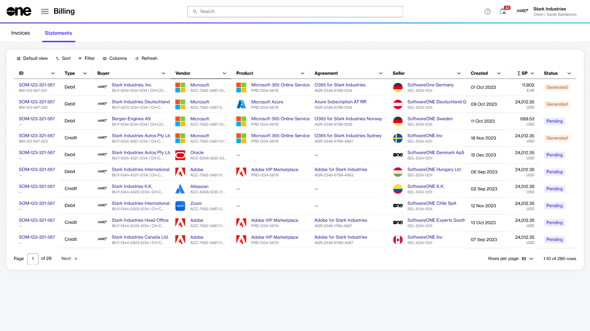

# Statements

A statement is a billing document you receive at the end of your billing period, along with your invoice PDF.

Statements are issued as Excel (`.xlsx`) files and they contain a detailed view of your invoice data, including individual charges, subscriptions, and orders for the billing period. A statement contains the following tabs:

* **Summary** - Contains objects associated with the statement (for example, agreement, licensee, and orders) with links to open them in the platform.
* **Charges** - Contains charges and subscriptions for the billing period. You can also see items within subscriptions, their quantities, and prices. If [split billing](split-billing/) is enabled, allocation percentage and estimated license count (ELC) details are also displayed.
* **Orders** - Contains all orders placed during the billing period, including order type, order date, and related details.

### Accessing statements

The **Statements** page allows you to view all statements for your account.

To navigate to the **Statements** page, select the main menu, then choose **Billing** > **Statements**. The list of statements is displayed, as shown in the following image:

<figure><figcaption>
The Statements page in the Marketplace Platform.
</figcaption></figure>

On the **statements** page, you can view various details for each statement, including the statement ID, creation date, estimated sales price, current status, and more.&#x20;

You can also select a statement ID to view detailed information organized across several tabs. The information available includes:

* A list of charges and subscriptions for the billing period.
* Official statement PDFs.
* A record of events or logs for the statement.&#x20;

### Related topics


[view-statements.md](../../billing/statements/view-statements.md)



[filter-billing-statements.md](../../billing/statements/filter-billing-statements.md)



[view-charges.md](../../billing/statements/view-charges.md)



[download-statements.md](statements/download-statements.md)

