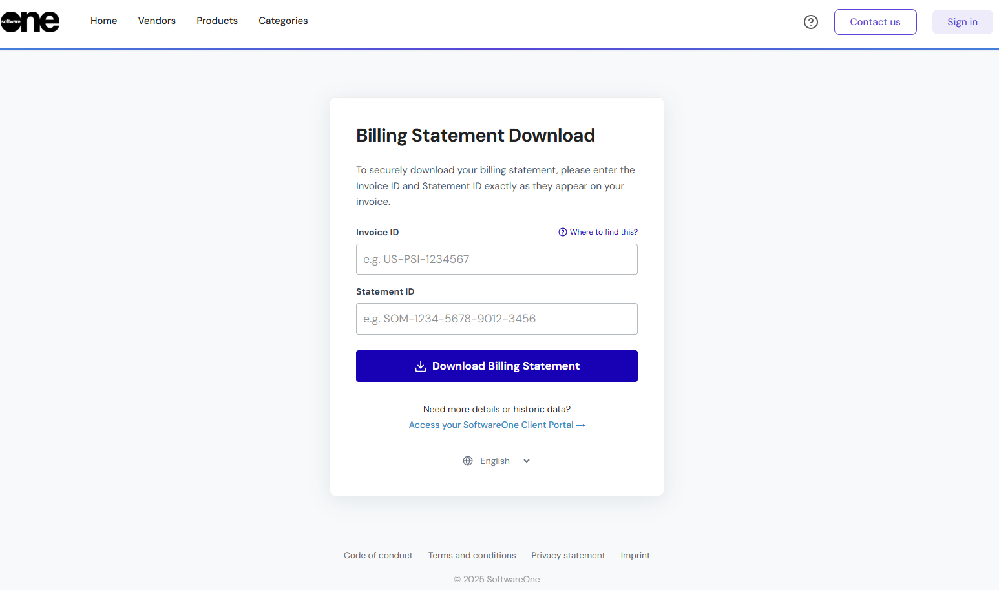

# Download Statements

You can download your billing statements from two locations: the **Statements** page after signing in to your Marketplace account, or the [Billing Statement Download](https://mystatements.platform.softwareone.com/) page without signing in.&#x20;

## Downloading a statement (sign-in required)

To download your statement from the Marketplace Platform:

1. Sign in to your account.
2. Navigate to the **Statements** page.
3. (Optional) Refine your list of statements. You can filter statements using criteria, such as status, type, ID, and more. For details, see [Filter Billing Statements](../../../billing/statements/filter-billing-statements.md).
4. Locate the statement to download, then select the statement ID.&#x20;
5. On the statement details page, select the **Attachments** tab, and do one of the following:
   * Select the link in the **Reference** column.
   * Select the actions icon (**•••**) and choose **Download**.&#x20;

## Downloading a statement (no sign-in required)

If you cannot access your account, you can still download your statement from the [Billing Statement Download](https://mystatements.platform.softwareone.com/) page. This page is publicly available, allowing you to download your statement using your unique invoice ID and statement ID.

To download your statement:

1. Open your invoice. Then, note down the statement ID and invoice ID.

<figure><figcaption>
The invoice header containing the invoice ID and statement ID.
</figcaption></figure>

2. Navigate to the [Billing Statement Download](https://mystatements.platform.softwareone.com/) page.
3. Enter your **Invoice ID** and **Statement ID** exactly as shown on the invoice, then select **Download Billing Statement**.

<figure><figcaption>
Use the Billing Statement Download page to download your statement.
</figcaption></figure>

4. When the download is ready, select **Download Now** to begin downloading the file.

After downloading the file, you can view detailed charges, subscriptions, and orders placed during the billing period.&#x20;
