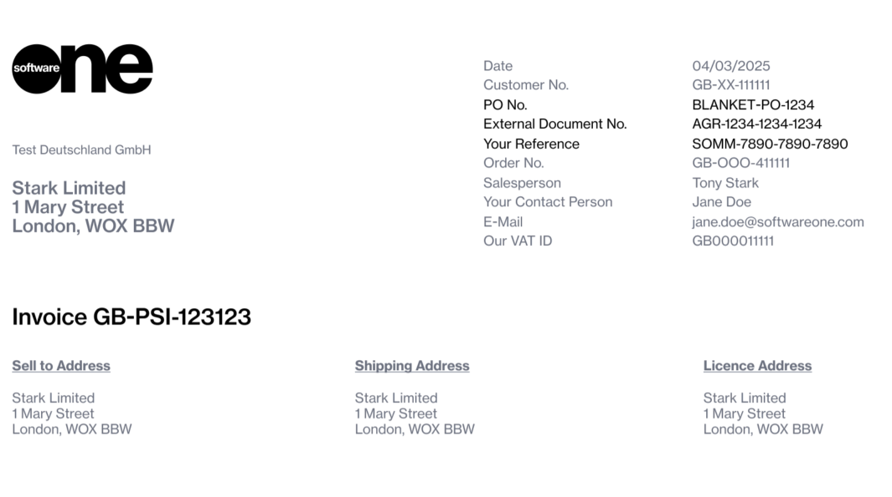
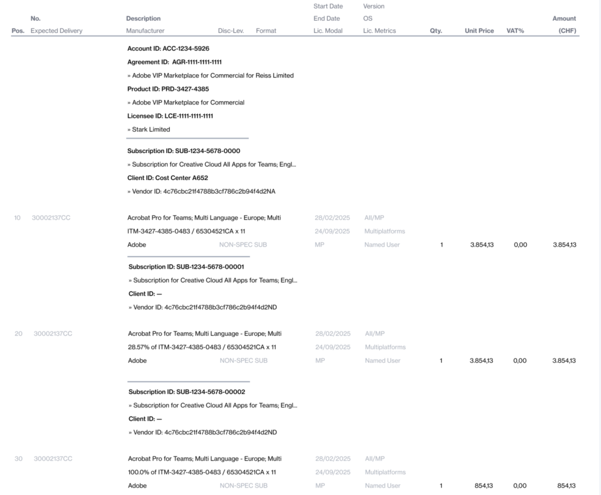

# Understand Your Billing Documents

The Marketplace Platform's automated billing process issues documents based on subscription charges or usage data recorded in the previous calendar month.&#x20;

For many cloud-based services, such as Microsoft Azure and Adobe VIP Marketplace, the usage data can result in multiple charge lines on a single billing statement. When each charge line is printed individually on a single invoice, it can be challenging to read and interpret.

To enhance clarity and help you monitor charges more efficiently, the Marketplace Platform issues two types of billing documents: **Invoices** and **Statements**. These billing documents contain important information about your transactions. Understanding these documents is crucial to ensure accuracy.&#x20;

Use the information on this page or watch the following video guide to learn more:


Watch our video guide about invoices and statements in recurring billing


## Billing invoices

An invoice is a billing document you receive for your purchases.

Marketplace invoices are issued as PDFs in the context of specific agreements. They contain a summary of charges and details like your customer information and payment terms. Invoice PDFs also include subscription details and the consolidated charges for all items within the subscription.&#x20;

Marketplace invoices contain sections so you can understand them easily. To view a sample invoice, use the following link:


Download a sample Marketplace invoice


### Invoice header

The invoice header contains general information, such as the date when the invoice was created, your customer number, and contact person details. The invoice number and address details are also included in the header.&#x20;

<figure><figcaption>
Invoice header
</figcaption></figure>

The following table describes the key data in the invoice header:

<table><thead><tr><th width="270">Field</th><th>Description</th></tr></thead><tbody><tr><td>Purchase order number (PO No.)</td><td>
The value is taken from the value in the <strong>Additional ID</strong> field, available on the <strong>Details</strong> tab of the <a href="../agreements/#subscription-details">agreement details page</a>. 

<ul><li>If the value exceeds 20 characters, only the first 16 characters are shown on the invoice, followed by 3 dots (...).</li><li>If the <strong>Additional ID</strong> field is empty, the <strong>PO No</strong> on the invoice is displayed as  "<strong>—</strong>". To add a value, go to the <strong>Details</strong> tab on the agreement details page. Then, select <strong>Edit</strong>, and enter the value under <strong>Additional IDs</strong>. </li></ul></td></tr><tr><td>External document number</td><td>Represents the ID of the agreement for which the invoice has been generated. Agreement IDs are shown on the agreement details page.</td></tr><tr><td>Your reference</td><td>Displays the ID of the statement associated with the invoice.</td></tr></tbody></table>

### Invoice details

The invoice details section includes all subscriptions and items for which you are being invoiced
. Note that this section may be more than one page, depending on the data.&#x20;

<figure><figcaption>
Invoice details section
</figcaption></figure>

The following table describes the key data in this section:

<table><thead><tr><th width="202">Column</th><th>Description</th></tr></thead><tbody><tr><td>Description</td><td>
Includes a header that displays identifiers such as account ID, agreement ID, and more. You can also see all subscriptions linked to the agreement and the items within each subscription. 

If <a href="split-billing/">split billing</a> has been enabled, the configured allocation percentage is also displayed. 
</td></tr><tr><td>Quantity</td><td>Displays the quantity of items. The value is always '1' because we consolidate all charges. Refer to your Marketplace billing statement for details on the actual item quantity.</td></tr><tr><td>Unit price</td><td>Displays the total charges for each item in the subscription.</td></tr></tbody></table>

## Billing statements

A billing statement is a detailed record of charges, and it's issued for each invoice.&#x20;

Unlike an invoice PDF, which only provides a summary of charges, a statement contains a comprehensive breakdown of all charges. To view a sample statement, use the following link:


Download a sample Marketplace billing statement


A SoftwareOne Marketplace billing statement contains these tabs:

* **Summary** - Contains different objects associated with the statement, such as agreement, licensee, and orders. The page also contains links that you can use to access these objects directly in the platform.
* **Charges** - Contains a list of charges and subscriptions for the billing period. You can also view all items within the subscription, their quantities, and prices. If [split billing](split-billing/) has been enabled, the subscription allocation percentage and estimated license count (ELC) details are also displayed.&#x20;
* **Orders** - Contains all orders placed during the billing period and their corresponding details, such as the type of order, the date when the order was placed, and more.

## Differences between invoices and statements 

An invoice and a statement are both billing documents, but they serve different purposes. The following table lists the key differences between these two types of documents:

<table><thead><tr><th width="198">Component</th><th width="267">Invoice</th><th width="249">Statement</th></tr></thead><tbody><tr><td>Purpose</td><td>Provides a high-level summary of the charges.</td><td>Provides a full record of the charges from the vendor.</td></tr><tr><td>Format</td><td>PDF</td><td>Excel</td></tr><tr><td>Level of detail</td><td>Contains aggregated lines, such as per item, per subscription, and so on.</td><td>Can have hundreds or thousands of lines for precise usage.</td></tr><tr><td>Use case</td><td>Used as an official billing and record-keeping document.</td><td>Used for reconciliation, in-depth audits, and analysis.</td></tr><tr><td>Quantity</td><td>Always displays the quantity as 1 because multiple lines are consolidated.</td><td>Each line shows the actual quantity of items.</td></tr></tbody></table>


**Have billing-related questions?**&#x20;

See this FAQ to get answers to commonly asked questions:[ I have questions about billing](../../../help-and-support/faqs/i-have-questions-about-billing.md).

