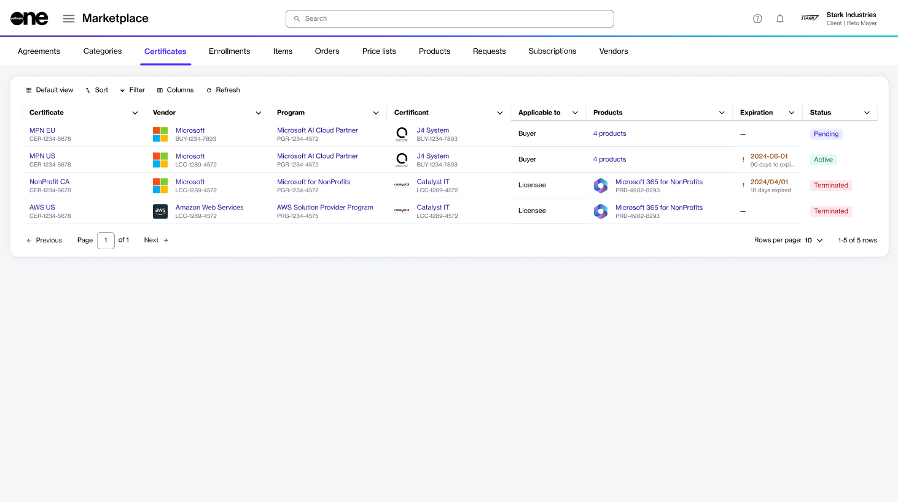

# Certificates

Certificates management is a feature that lets you access and manage your certificates for all the programs you are enrolled in.

In the Marketplace Platform, a certificate is an object, which demonstrates that you meet the vendor's requirements and eligibility criteria for a program. Holding a certificate means you are eligible to purchase products and enjoy all benefits and incentives associated with the program.&#x20;

You can view all certificates on the **Certificates** page on the platform. This includes your pending certificates that are awaiting approval from the vendor as well as active, expired, or terminated certificates.&#x20;

Through certificates management, you can also apply for a certificate by enrolling in a program, add your existing certificate for a program, and rename a certificate for ease of identification.

## Certificates interface

You can access the **Certificates** page by selecting **Marketplace** > **Certificates** from the main menu.

<figure><figcaption>
Certificates page
</figcaption></figure>

For each certificate, you can view the following details:

* **Certificate** - Displays the name and unique ID of the certificate.
* **Vendor** - Displays the name of the vendor associated with the program.
* **Program** - Displays the program for which the certificate has been issued.
* **Certificant** - Displays the name and ID of the entity to whom the certificate is issued.
* **Applicable to** - Indicates whether the certificant is a buyer or licensee in the platform.
* **Products** - Displays all products that are covered by the specific program.
* **Expiration** - Displays the expiration date of the certificate. You can also view the number of days that remain before the certificate expires.&#x20;
* **Status** - Displays the certificate's status. For a description of the possible statuses, see [Certificate States](certificate-states.md).

## Certificate details page 

The details page displays general information and properties associated with your selected certificate. You can open this page by selecting the certificate on the **Certificates** page.&#x20;

<figure><figcaption>
Certificate details page
</figcaption></figure>

The details page also includes an **Edit** option for renaming a certificate, and it is organized into the following tabs:

* **General** - Displays the general information for the certificate.&#x20;
* **Parameters** - Displays the ordering parameters associated with the certificate. The parameters are defined by the vendors, so they might vary depending on the program.
* **Enrollments** -&#x20;
* **Products** - Displays the products and services that are offered as part of the program.
* **Agreements** -
* **Details** - Displays a history of events associated with the certificate, for example, the date and time when the certificate was added.
