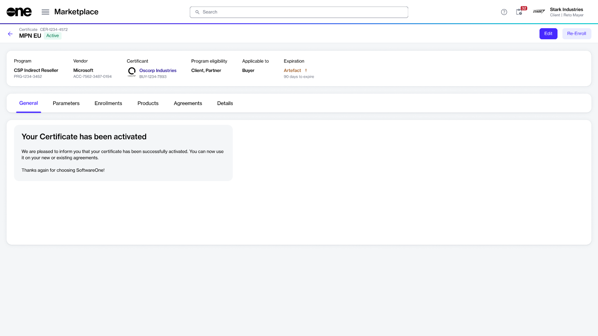

# Certificates

In the Marketplace Platform, a certificate is an object that demonstrates that you meet the vendor's requirements and eligibility criteria for a program.&#x20;

Holding a certificate means you are eligible to purchase products and enjoy all the benefits and incentives associated with the program.&#x20;

You can view and manage your certificates for different programs on the **Certificates** page in the platform. This includes certificates that might be awaiting approval from the vendor, as well as active, expired, or terminated certificates.&#x20;

<figure><figcaption>
Certificates page
</figcaption></figure>

The page displays various properties associated with the certificates, such as the certificate's name and ID, the name of the certificant, current status, and more.

## Viewing certificate details 

To view the details page, select the certificate on the **Certificate** page.

<figure><figcaption>
Certificate details page
</figcaption></figure>

At the top of the details page, you can see the information, such as the program for which the certificate has been issued, the program's vendor, and other certificate details.&#x20;

The details page also contains tabs that give you more information about the certificate. The following table lists these tabs:

<table><thead><tr><th width="243">Tab</th><th>Description</th></tr></thead><tbody><tr><td><strong>General</strong> </td><td>Displays a status message for the certificate, for example, to indicate if your certification is pending activation or has been activated. </td></tr><tr><td><strong>Parameters</strong></td><td>Displays the ordering and fulfillment parameters for the certificate.</td></tr><tr><td><strong>Enrollments</strong> </td><td>Displays the linked enrollment.</td></tr><tr><td><strong>Details</strong> </td><td>Displays the timestamps and additional IDs, if applicable.</td></tr><tr><td><strong>Audit trail</strong></td><td>Displays an audit trail including the log details and summary. To learn more, see <a href="../../settings/audit-trail.md">Audit Trail</a>.</td></tr></tbody></table>

## Additional actions

From the details page, you can [rename your certificate](rename-certificate.md) using the **Edit** option.&#x20;
