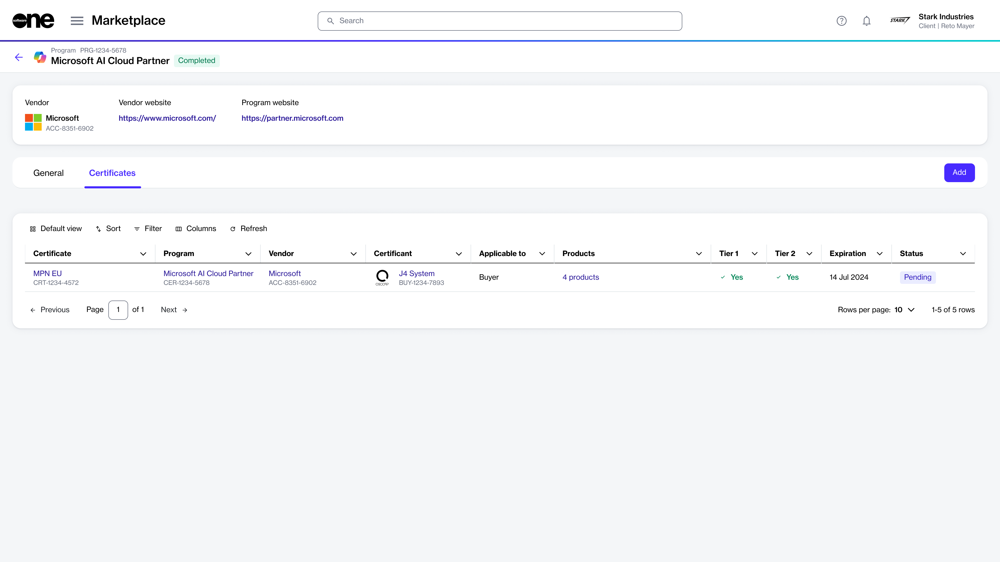

# Add Certificate

If you are already enrolled in a program and want to add your certificate for that program to the Marketplace, you can do this through the **Certificates** page in the platform.&#x20;

Adding a certificate makes it available during the ordering process. When ordering products under a specific program, selecting the certificate will ensure that you receive the benefits that come with that program.

To enroll in a program, you will need your Microsoft Partner Network (MPN) ID and email address.&#x20;

## Adding a certificate

To add your certificate for a program:&#x20;

1. Navigate to the **Programs** page in the platform.
2. Select the required program.&#x20;
3. On the program's details page, select the **Certificates** tab. Then, select **Add** to start the **Add certificate** wizard.

<figure><figcaption>
Add option on the Certificates tab
</figcaption></figure>

4. On the **Certificant** page, choose a certificant from the list and select **Next**.
5. On the **Partner details** page, select the country you want to transact in and provide the necessary partner information, such as the email address and partner network ID associated with your partner account. When done, select **Next**.&#x20;
6. On the **Details** page, enter a certificate name and select **Next**.&#x20;
7. On the **Overview** page, review the details and select **Add**.

Your certificate is added and ready for use within the Marketplace. Select **View details** to open the enrollment details page. Otherwise, select **Close**.
