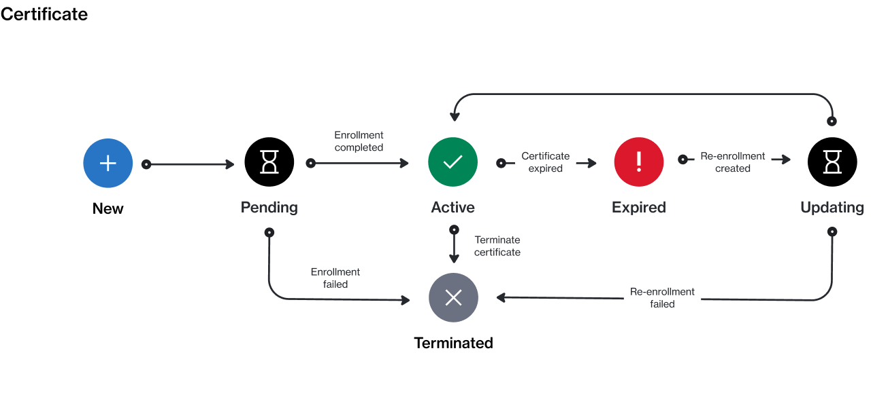

# Certificate States

In the Marketplace Platform, a certificate can have several states (also known as status).&#x20;

The following diagram shows the possible states and the transition between these states:

<figure><figcaption>
Certificate state transition
</figcaption></figure>

These states are displayed as **Status** within the platform. They are also shown beside the certificate name and ID on the details page.

<table data-full-width="false"><thead><tr><th width="152">State</th><th>Definition</th></tr></thead><tbody><tr><td><strong>New</strong></td><td>This is the initial status and it's assigned by the platform during the program enrollment request is being created.</td></tr><tr><td><strong>Pending</strong></td><td>The certificate has been created for the enrollment request, and it's awaiting approval by the vendor.</td></tr><tr><td><strong>Active</strong></td><td>The certificate is active.</td></tr><tr><td><strong>Expired</strong></td><td>The certificate has expired. You can renew an expired certificate by <a href="../enrollments/renew-your-enrollment.md">re-enrolling in the program</a>.</td></tr><tr><td><strong>Updating</strong></td><td>The certificate is being updated by the re-enrollment process.</td></tr><tr><td><strong>Terminated</strong></td><td>The certificate has been terminated. Terminated certificates can't be used to re-enroll to the program. </td></tr></tbody></table>

