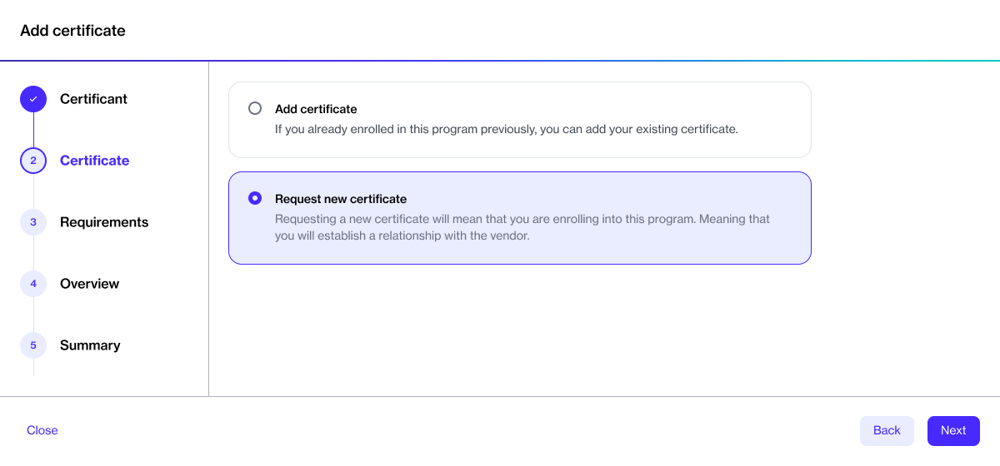

# Request Certificate

The **Programs** page in the Marketplace displays all active programs available for enrollment.&#x20;

To enroll in a program, you'll need to create an enrollment request and include your organization's name, email address, and website URL in the request. Your request will then be submitted to the vendor for approval.

## Creating a new enrollment request

To request a certificate for a program:&#x20;

1. On the **Programs** page, select the program you want to enroll in.&#x20;
2. On the program's details page, select **Add** to start the add certificate wizard.

<figure><figcaption>
Add option on the certificates tab
</figcaption></figure>

3. On the **Certificant** page, select a certificant from the list and select **Next**.
4. On the **Certificate** page, choose **Request new certificate**, then select **Next**.

<figure><figcaption>
Request new certificate option
</figcaption></figure>

5. On the **Requirements** page, provide your company details, such as name, email, and website. These fields are mandatory. When done, select **Next**. &#x20;
6. On the **Details** page, enter a name for the certificate along with your Microsoft partner ID.
7. Review all selections and then select **Add**.

A certificate is created with a Pending status. Select **View** to open the **Enrollments** page. Otherwise, select **Close** to exit the wizard. &#x20;

If your enrollment is approved by the vendor, the certificate's status will change to **Active,** and you can use this certificate when ordering products and services through the platform.
