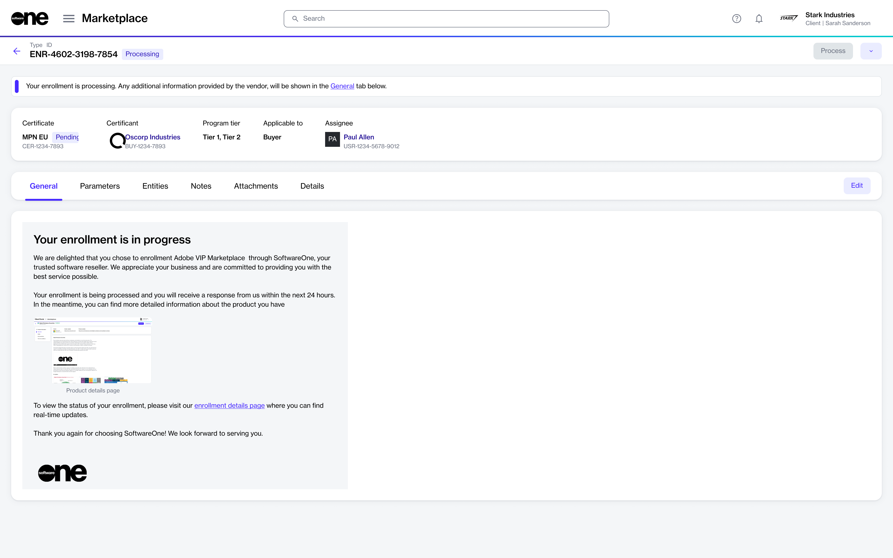

# Enrollments

In the Marketplace Platform, enrollment is the process of registering in a specific vendor program.&#x20;

Enrolling in a program makes you eligible for all benefits and incentives associated with that program. The benefits may include reduced pricing, special offers, renewal discounts, and so on.

To enroll in a program, you must fulfill all specified requirements, which may include submitting necessary documentation or meeting certain criteria established by the vendor. If you meet all the requirements, the vendor enrolls you in the program and issues a certificate.&#x20;

The process of enrolling in a program through the Marketplace Platform involves the following steps:

1. Select the program from the catalog on the [Programs ](../programs.md)page.
2. Provide information according to the program's parameters, including your partner details.&#x20;
3. Review and submit the enrollment request to the vendor.&#x20;
   * If your request is approved, you'll receive a certificate.
   * If the vendor requires more information to process your enrollment, your request will move to the **Querying** state. The [enrollment details page](./#subscription-details) will specify the information you must provide.
   * If you don't meet the program's criteria or requirements, your enrollment request is rejected.

You can view all your enrollments on the **Enrollments** page in the platform.

<figure><figcaption>
Enrollments page
</figcaption></figure>

## Viewing enrollment details 

To view the details page of an enrollment, select the enrollment on the **Enrollments** page.

<figure><figcaption>
Enrollment details page
</figcaption></figure>

At the top of the details page, you can see some essential enrollment information, including the enrollment ID and its current status. A status message is also displayed to provide further context.

The details page also contains tabs that display additional details. The following table lists these tabs:

<table><thead><tr><th width="261">Tab</th><th>Description</th></tr></thead><tbody><tr><td><strong>General</strong></td><td>Displays the latest information and enrollment status. </td></tr><tr><td><strong>Parameters</strong></td><td>Displays the enrollment parameters.</td></tr><tr><td><strong>Entities</strong> </td><td>Displays the objects, such as Buyer, Licensee, and Seller, linked to the enrollment. </td></tr><tr><td><strong>Details</strong></td><td>Displays timestamps for the different events related to the enrollment, such as the date and time the enrollment was created.</td></tr><tr><td><strong>Attachments</strong></td><td>Displays any files that may have been attached to the enrollment.</td></tr><tr><td><strong>Audit trail</strong></td><td>Displays an audit trail including the log details and summary. To learn more, see <a href="https://docs.platform.softwareone.com/modules-and-features/settings/audit-trail">Audit Trail</a>.</td></tr></tbody></table>
