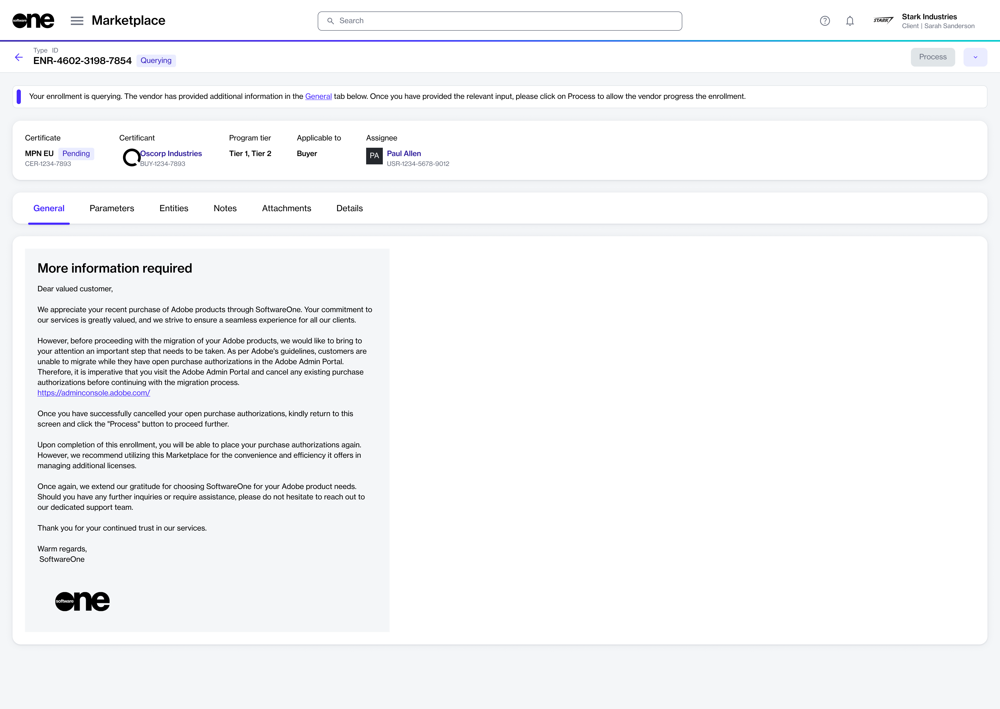

# Manage Querying Enrollments

In some cases, a vendor may request you to provide additional information regarding your enrollment. You may also be required to complete some steps before your enrollment can be approved by the vendor.&#x20;

Use the following steps to identify and action such enrollments:

1. Navigate to the **Enrollments** page in the Marketplace Platform.
2. From your list of enrollments, select the enrollment in a **Querying** status. If required, [use filters](../../../marketplace-platform/getting-started/marketplace-for-clients/how-to-filter-your-orders.md) to find the enrollment in your list of enrollments.
3. On the enrollment details page, read the message in the header and the **General** tab and take action according to the message. The following image shows an example:

<figure><figcaption>
Enrollment with a Querying status
</figcaption></figure>

4. Select **Process** to submit the completed enrollment to the vendor for processing. The enrollment status will change from **Querying** to **Pending**.
